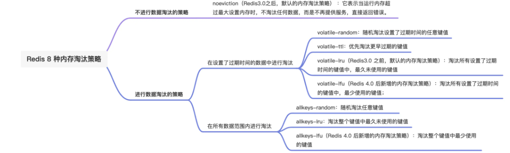

## GPT模拟面试

### 模拟面试①

**面试开始**

##### **1. MySQL 相关问题**

> 请描述一下 MySQL 中 InnoDB 和 MyISAM 存储引擎的主要区别。

**答：**

**InnoDB 和 MyISAM 存储引擎的主要区别：**

- **事务支持：** InnoDB 支持事务，提供行级锁定，而 MyISAM 不支持事务。
- **外键约束：** InnoDB 支持外键约束，MyISAM 则不支持。
- **存储格式：** InnoDB 存储的数据是按主键顺序排列的，而 MyISAM 存储的数据没有特定顺序。
- **锁机制：** InnoDB 支持行级锁定，更适用于多用户并发环境；MyISAM 使用表级锁定，在写入密集型应用中可能会导致性能问题。
- **崩溃恢复：** InnoDB 支持崩溃恢复机制，而 MyISAM 在服务器崩溃后可能需要修复。

> 当你在设计数据库时，如何选择合适的索引类型？

- 在设计数据库时，选择合适的索引类型需要考虑多个因素，以下是一些指导原则：

  **一、了解不同索引类型的特点**

  1. B 树索引
     - 特点：适合范围查询和精确匹配查询。它可以快速定位到包含特定值的记录，并且对于范围查询（如大于、小于、介于某个范围之间）也有较好的性能。
     - 适用场景：当表中的数据有大量的范围查询需求，或者需要对特定列进行精确匹配查询时，可以考虑使用 B 树索引。例如，在一个订单表中，如果经常需要根据订单日期进行范围查询，或者根据订单编号进行精确查询，那么在订单日期和订单编号列上创建 B 树索引是一个不错的选择。
  2. 哈希索引
     - 特点：哈希索引基于哈希函数，能够快速定位到具有特定哈希值的记录。它对于精确匹配查询非常高效，但不支持范围查询。
     - 适用场景：当查询主要是精确匹配，并且数据量较大时，哈希索引可以提供非常快的查询速度。比如，在用户登录场景中，根据用户名进行查询时，可以使用哈希索引来快速定位用户记录。
  3. 全文索引
     - 特点：专门用于对文本内容进行搜索。它可以对文本中的关键词进行索引，支持复杂的文本搜索操作，如模糊搜索、短语搜索等。
     - 适用场景：对于存储大量文本内容的表，如文章、博客等，如果需要进行文本搜索，那么创建全文索引是必要的。例如，一个新闻网站的文章表，可以在文章内容列上创建全文索引，以便用户能够快速搜索到感兴趣的文章。

  **二、考虑数据的特点和查询需求**

  1. 数据类型
     - 数值类型：对于整数、浮点数等数值类型的数据，如果经常进行范围查询，可以选择 B 树索引。
     - 字符串类型：如果字符串长度较短且查询主要是精确匹配，可以考虑哈希索引。如果字符串较长且需要进行文本搜索，那么全文索引是合适的选择。
     - 日期时间类型：对于日期时间类型的数据，如果经常进行范围查询，B 树索引是较好的选择。
  2. 查询模式
     - 频繁查询的列：如果某些列经常在查询中被使用，那么在这些列上创建索引可以提高查询性能。例如，在一个客户表中，如果经常根据客户姓名和地址进行查询，那么在姓名和地址列上创建索引是有必要的。
     - 范围查询和排序：如果查询中经常涉及范围查询（如大于、小于、介于某个范围之间）或者需要对结果进行排序，那么 B 树索引通常是更好的选择，因为它能够有效地支持这些操作。
     - 精确匹配查询：如果查询主要是精确匹配，那么哈希索引可能会提供更快的查询速度。但是需要注意，哈希索引不支持范围查询。

  **三、考虑数据库的性能和资源使用**

  1. 索引维护成本
     - 索引的创建和维护会占用额外的存储空间和计算资源。当对表中的数据进行插入、更新和删除操作时，索引也需要进行相应的更新，这会增加数据库的负担。因此，在选择索引类型时，需要考虑索引的维护成本。如果表中的数据频繁更新，那么过多的索引可能会导致性能下降。
     - 例如，在一个交易记录表中，如果数据不断地被插入和更新，那么创建过多的索引可能会影响数据库的写入性能。在这种情况下，可以根据实际查询需求，选择关键列创建索引，以平衡查询性能和写入性能。
  2. 内存和存储限制
     - 索引会占用一定的内存和磁盘空间。如果数据库的内存和存储资源有限，那么需要谨慎选择索引类型和数量，以避免资源耗尽。对于大型数据库，可能需要考虑使用分区索引等技术来优化索引的存储和访问。
     - 例如，在一个拥有大量数据的数据库中，如果内存不足以容纳所有的索引，可以考虑将索引存储在磁盘上，并通过优化磁盘 I/O 来提高索引的访问速度。

  综上所述，选择合适的索引类型需要综合考虑数据的特点、查询需求、数据库的性能和资源使用等因素。在实际设计中，可以通过对数据库进行性能测试和分析，不断调整索引策略，以达到最佳的性能效果。

> 如何优化慢查询？请列举至少三种方法。

以下是优化 MySQL 慢查询的至少三种方法：

**一、分析慢查询日志**

1. 开启慢查询日志：在 MySQL 配置文件（通常是 my.cnf 或 my.ini）中设置参数开启慢查询日志，例如：

```ini
   slow_query_log = 1
   slow_query_log_file = /path/to/slow.log
   long_query_time = 2  # 设置查询超过 2 秒即记录为慢查询
```

1. 分析日志内容：通过分析慢查询日志，可以确定哪些查询执行时间较长。可以使用工具如 mysqldumpslow 来分析日志，找出最耗时的查询语句。
   - 例如，使用命令 “mysqldumpslow -s t -t 10 /path/to/slow.log” 可以查看最慢的 10 个查询。

**二、优化查询语句**

1. 合理使用索引：
   - 检查慢查询语句涉及的表是否有合适的索引。对于经常在查询条件中出现的列、连接条件中的列等创建索引。
   - 避免在索引列上进行函数操作或类型转换，这会导致索引无法使用。例如，不要在 “WHERE column_name + 1 = 10” 这样的条件中使用索引。
2. 避免全表扫描：
   - 尽量使用索引来定位数据，避免使用 “SELECT *” 查询所有列，只选择需要的列可以减少数据读取量。
   - 使用 LIMIT 限制返回的行数，特别是在分页查询中，避免查询大量不必要的数据。
3. 优化连接查询：
   - 确保连接条件正确且使用了合适的索引。尽量减少连接的表数量，避免复杂的多表连接。
   - 对于大表连接，可以考虑使用临时表或子查询来优化性能。

**三、数据库结构优化**

1. 表分区：
   - 对于数据量大的表，可以考虑使用表分区，将数据分散到不同的物理存储上，提高查询性能。例如，按照时间范围对一个日志表进行分区。
2. 垂直拆分和水平拆分：
   - 垂直拆分是将一个表的列拆分成多个表，把经常一起查询的列放在一个表中，不经常一起查询的列放在另一个表中。
   - 水平拆分是将一个表的数据按照某种规则分散到多个表中，例如按照用户 ID 进行拆分，每个表存储一部分用户的数据。

##### **2. Redis 相关问题**

>  Redis 支持哪些数据结构？请举例说明这些数据结构的使用场景。

**Redis 支持的数据结构及应用场景：**

- **String（字符串）**：最简单的键值对，可用于缓存简单的值。
- **Hash（哈希）**：用于存储字段-值对映射，适合用户信息等复杂数据。
- **List（列表）**：双端队列，适用于消息队列和最近访问记录。
- **Set（集合）**：无序且唯一元素的集合，用于统计唯一用户数等。
- **ZSet（有序集合）**：有序且唯一元素的集合，用于排行榜等。
- **HyperLogLog**：用于近似计数大量元素的数量。
- **Bitmaps**：用于高效存储位信息，例如统计用户是否登录过。

> Redis 中的持久化方式有哪些？它们各有什么优缺点？

**Redis 的持久化方式及其优缺点：**

- RDB（快照）：在指定的时间点将数据集保存到磁盘。
  - **优点：** 快速恢复数据。
  - **缺点：** 数据丢失风险较高。
- AOF（Append Only File）：每次写操作都会被追加到文件中。
  - **优点：** 数据丢失风险较低。
  - **缺点：** 文件体积大，恢复速度较慢。

>  如果 Redis 的内存满了，会发生什么情况？Redis 提供了哪些策略来处理这种情况？

内存淘汰策略是解决内存过大的问题，当 Redis 的运行内存超过最大运行内存时，就会触发内存淘汰策略，Redis 4.0 之后共实现了 8 种内存淘汰策略，我也对这 8 种的策略进行分类，如下：

 


##### **3. Go 语言相关问题**

>  请解释一下 Go 语言中的接口（interface）和它的用途。

在 Go 语言中，接口定义了一组方法的集合，但并不提供这些方法的具体实现。任何实现了接口中所有方法的类型都可以自动满足该接口。这使得 Go 的接口可以被看作是鸭子类型（duck typing），即“如果它像鸭子一样走路，像鸭子一样叫，那么它就是一只鸭子”。

##### **4. Go-zero 相关问题**

> 请简述一下 go-zero 框架的主要优势。

- **高性能**：go-zero 使用了高效的网络模型和并发模式，能够处理高并发场景。
- **代码生成**：通过 proto 文件自动生成服务和客户端代码，减少重复工作。
- **服务治理**：内置的服务发现、负载均衡和健康检查机制简化了服务管理。
- **可扩展性**：支持水平扩展，易于添加新的服务实例。
- **易用性**：提供了丰富的文档和示例，易于上手。

> 如何开始使用 go-zero ？

- **安装依赖**：首先需要安装 Go 语言环境。
- **安装 goctl**：go-zero 使用 goctl 工具来自动生成代码。
- **编写 proto 文件**：定义服务接口和消息结构。
- **生成代码**：使用 goctl 生成服务和客户端代码。
- **编写业务逻辑**：实现服务的具体业务逻辑。
- **运行服务**：启动服务，并进行测试。

> go-zero 如何处理服务间的通信？

- **gRPC**：go-zero 默认支持 gRPC 协议，适用于高性能的服务间通信。
- **HTTP**：也支持通过 RESTful API 方式进行服务间通信。
- **超时控制**：可以通过配置文件或者在代码中使用 `context.Context` 控制请求的超时时间。

> go-zero 怎么进行服务发现？

- **Consul**：go-zero 支持使用 Consul 作为服务发现的后端。
- **Etcd**：也可以使用 Etcd 进行服务发现和配置管理。
- **内置服务发现**：go-zero 提供了简单的内置服务发现机制，无需额外依赖。


### 模拟面试②

##### 1. Go语言相关问题

> 问题1： Go 语言的标准库中并没有提供并发安全的 map。请描述一下如何实现一个并发安全的 map，并讨论其潜在的性能影响。

**方法一**：我们可以通过包装标准库中的 `map` 类型，并为其添加互斥锁（`sync.Mutex`）来实现一个并发安全的 `map`。这可以确保在多线程环境中对 `map` 的读写操作不会引发竞态条件。

**方法二：**使用channel，将map装进channel中，需要用时从channel中取出，用完再放回，可以保证并发安全

> 问题2：请解释一下Go的内存分配器和垃圾回收器是如何工作的，以及它们是如何影响程序的性能的？

**内存分配器**

Go的内存分配器使用了一种混合策略，它试图平衡分配速度和内存利用率。

分配器将请求分为小块（小于32KB）和大块（大于等于32KB），分别使用不同的策略来处理。

小块内存使用一种称为 span 的结构进行管理，而大块内存直接从操作系统分配。

**垃圾收集器**

Go


> 问题3：描述一下如何通过代码编写习惯来优化内存使用，以减少GC


**5. 计算机网络相关问题**

- TCP 和 UDP 协议的主要区别是什么？在何种情况下你会选择使用 UDP 而不是 TCP？
- 解释一下 HTTP/2 和 HTTP/1.1 之间的主要区别。
- 在设计网络应用时，如何处理高并发请求？请给出至少两种解决方案。

