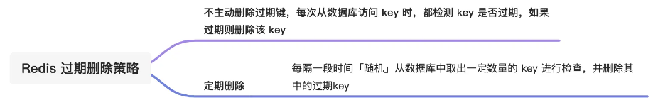

### Redis 八股

> #### **1.** 说说 Redis 内存淘汰策略和过期删除策略

Redis 使用的过期删除策略是「惰性删除+定期删除」，删除的对象是已过期的 key。

 

内存淘汰策略是解决内存过大的问题，当 Redis 的运行内存超过最大运行内存时，就会触发内存淘汰策略，Redis 4.0 之后共实现了 8 种内存淘汰策略，我也对这 8 种的策略进行分类，如下：

 

> #### **2.** Redis有哪2种持久化方式？分别的优缺点是什么？

Redis 的读写操作都是在内存中，所以 Redis 性能才会高，但是当 Redis 重启后，内存中的数据就会丢失，那为了保证内存中的数据不会丢失，Redis 实现了数据持久化的机制，这个机制会把数据存储到磁盘，这样在 Redis 重启就能够从磁盘中恢复原有的数据。Redis 共有三种数据持久化的方式：

- **AOF 日志**：每执行一条写操作命令，就把该命令以追加的方式写入到一个文件里；
- **RDB 快照**：将某一时刻的内存数据，以二进制的方式写入磁盘；

Redis 提供了 3 种写回硬盘的策略， 在 Redis.conf 配置文件中的 appendfsync 配置项可以有以下 3 种参数可填：

- **Always**，这个单词的意思是「总是」，所以它的意思是每次写操作命令执行完后，同步将 AOF 日志数据写回硬盘；
- **Everysec**，这个单词的意思是「每秒」，所以它的意思是每次写操作命令执行完后，先将命令写入到 AOF 文件的内核缓冲区，然后每隔一秒将缓冲区里的内容写回到硬盘；
- **No**，意味着不由 Redis 控制写回硬盘的时机，转交给操作系统控制写回的时机，也就是每次写操作命令执行完后，先将命令写入到 AOF 文件的内核缓冲区，再由操作系统决定何时将缓冲区内容写回硬盘。

| 写回策略 | 写回时机       | 优点                             | 缺点                               |
| -------- | -------------- | -------------------------------- | ---------------------------------- |
| Always   | 同步写回       | 可靠性高、最大程度保证数据不丢失 | 每个写命令都要写回硬盘，性能开销大 |
| Everysec | 每秒写回       | 性能适中                         | 宕机时会丢失 1 秒内的数据          |
| No       | 由操作系统写回 | 性能好                           | 宕机时丢失的数据可能会很多         |

##### AOF 和 RDB 的优缺点

**AOF：**

- **优点：**首先，AOF提供了更好的数据安全性，因为它默认每接收到一个写命令就会追加到文件末尾。即使Redis服务器宕机，也只会丢失最后一次写入前的数据。其次，AOF支持多种同步策略（如everysec、always等），可以根据需要调整数据安全性和性能之间的平衡。同时，AOF文件在Redis启动时可以通过重写机制优化，减少文件体积，加快恢复速度。并且，即使文件发生损坏，AOF还提供了redis-check-aof工具来修复损坏的文件。
- **缺点**:因为记录了每一个写操作，所以AOF文件通常比RDB文件更大，消耗更多的磁盘空间。并且，频繁的磁盘IO操作（尤其是同步策略设置为always时）可能会对Redis的写入性能造成一定影响。而且，当问个文件体积过大时，AOF会进行重写操作，AOF如果没有开启AOF重写或者重写频率较低，恢复过程可能较慢，因为它需要重放所有的操作命令。

**RDB：**

- **优点**: RDB通过快照的形式保存某一时刻的数据状态，文件体积小，备份和恢复的速度非常快。并且，RDB是在主线程之外通过fork子进程来进行的，不会阻塞服务器处理命令请求，对Redis服务的性能影响较小。最后，由于是定期快照，RDB文件通常比AOF文件小得多。
- **缺点**: RDB方式在两次快照之间，如果Redis服务器发生故障，这段时间的数据将会丢失。并且，如果在RDB创建快照到恢复期间有写操作，恢复后的数据可能与故障前的数据不完全一致

> #### **3.**  redis主从和集群可以保证数据一致性吗 ？

redis 主从和集群在CAP理论都属于AP模型，即在面临网络分区时选择保证可用性和分区容忍性，而牺牲了强一致性。这意味着在网络分区的情况下，Redis主从复制和集群可以继续提供服务并保持可用，但可能会出现部分节点之间的数据不一致。

> #### **4.**  Redis集群的模式了解吗? 优缺点了解吗

[Redis面试题 | 小林coding (xiaolincoding.com)](https://xiaolincoding.com/interview/redis.html#redis集群的模式了解吗-优缺点了解吗)

当 Redis 缓存数据量大到一台服务器无法缓存时，就需要使用 **Redis 切片集群**（Redis Cluster ）方案，它将数据分布在不同的服务器上，以此来降低系统对单主节点的依赖，从而提高 Redis 服务的读写性能。

Redis Cluster 方案采用哈希槽（Hash Slot），来处理数据和节点之间的映射关系。在 Redis Cluster 方案中，**一个切片集群共有 16384 个哈希槽**，这些哈希槽类似于数据分区，每个键值对都会根据它的 key，被映射到一个哈希槽中，具体执行过程分为两大步：

- 根据键值对的 key，按照 CRC16 算法计算一个 16 bit 的值。
- 再用 16bit 值对 16384 取模，得到 0~16383 范围内的模数，每个模数代表一个相应编号的哈希槽。

接下来的问题就是，这些哈希槽怎么被映射到具体的 Redis 节点上的呢？有两种方案：

- **平均分配：** 在使用 cluster create 命令创建 Redis 集群时，Redis 会自动把所有哈希槽平均分布到集群节点上。比如集群中有 9 个节点，则每个节点上槽的个数为 16384/9 个。
- **手动分配：** 可以使用 cluster meet 命令手动建立节点间的连接，组成集群，再使用 cluster addslots 命令，指定每个节点上的哈希槽个数。

##### Redis 集群模式的优缺点

**优点：**

- **高可用性**：Redis集群最主要的优点是提供了高可用性，节点之间采用主从复制机制，可以保证数据的持久性和容错能力，哪怕其中一个节点挂掉，整个集群还可以继续工作。
- **高性能：**Redis集群采用分片技术，将数据分散到多个节点，从而提高读写性能。当业务访问量大到单机Redis无法满足时，可以通过添加节点来增加集群的吞吐量。
- **扩展性好：**Redis集群的扩展性非常好，可以根据实际需求动态增加或减少节点，从而实现可扩展性。集群模式中的某些节点还可以作为代理节点，自动转发请求，增加数据模式的灵活度和可定制性。

**缺点：**

- **部署和维护较复杂：**Redis集群的部署和维护需要考虑到分片规则、节点的布置、主从配置以及故障处理等多个方面，需要较强的技术支持，增加了节点异常处理的复杂性和成本。
- **集群同步问题：**当某些节点失败或者网络出故障，集群中数据同步的问题也会出现。数据同步的复杂度和工作量随着节点的增加而增加，同步时间也较长，导致一定的读写延迟。
- **数据分片限制：**Redis集群的数据分片也限制了一些功能的实现，如在一个key上修改多次，可能会因为该key所在的节点位置变化而失败。此外，由于将数据分散存储到各个节点，某些操作不能跨节点实现，不同节点之间的一些操作需要额外注意。

> #### **5.** 说说Redis中的分片集群与主从复制 

##### Redis 集群中的主从复制

Redis 集群中的主从复制是指每个主节点都有一个或多个从节点。从节点的作用主要有两个：

1. **读取副本**：从节点可以用来处理读取请求，这样可以减轻主节点的压力，提高读取性能。
2. **故障转移**：当主节点出现故障时，集群可以自动选择一个从节点提升为主节点，以确保服务的连续性。

##### **Redis 集群中的数据分片**

Redis 集群通过数据分片（sharding）将数据分布在多个节点上。数据分片的主要目的是：

1. **水平扩展**：通过将数据分布在多个节点上，可以提高整体的存储能力和处理能力。
2. **负载均衡**：数据分片可以帮助平衡不同节点上的负载，避免单一节点成为瓶颈。

**关于主从复制和数据分片的关系**

- **主从复制**：每个主节点都有一个或多个从节点。从节点用于提供读取操作，并在主节点故障时进行故障转移。
- **数据分片**：数据被分成多个哈希槽，每个槽可以由集群中的任意一个主节点负责。

**Redis 集群中的主从复制和数据分片如何协同工作**

1. **数据分片**：每个主节点负责一部分哈希槽的数据，这些数据分布在不同的主节点上。
2. **主从复制**：每个主节点都有一个或多个从节点，从节点复制主节点的数据，并处理读取请求。

**举例说明**

假设我们有 3 个主节点 M1、M2 和 M3，每个主节点都有一个从节点 R1、R2 和 R3。数据被分成 16,384 个哈希槽，这些槽均匀分布在 M1、M2 和 M3 上。例如：

- M1 负责哈希槽 0-5461
- M2 负责哈希槽 5462-10922
- M3 负责哈希槽 10923-16383

在这种情况下，客户端可以向任意一个主节点或从节点发送请求。例如，如果客户端想要写入一个键值对，它会首先计算键对应的哈希槽，然后将请求发送到负责该哈希槽的主节点。如果客户端需要读取数据，它可以向主节点或从节点发送请求。

**总结**

- **主从复制**：用于提高读取性能和实现高可用性。
- **数据分片**：用于水平扩展存储能力和处理能力。

**使用分片集群的目的**

- **提高存储能力**：通过分片可以将数据分布在多个节点上，提高整体的存储容量。
- **提高处理能力**：分片可以将负载分布在多个节点上，提高并发处理能力。
- **提高可用性**：通过主从复制和自动故障转移，可以提高系统的可用性。

**结论**

Redis 集群中的主从复制和数据分片是相互独立又相互配合的概念。主从复制用于提高读取性能和实现高可用性，而数据分片用于水平扩展存储能力和处理能力。两者结合使用，可以让 Redis 集群成为一个强大、可扩展的解决方案。