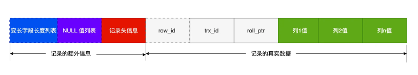
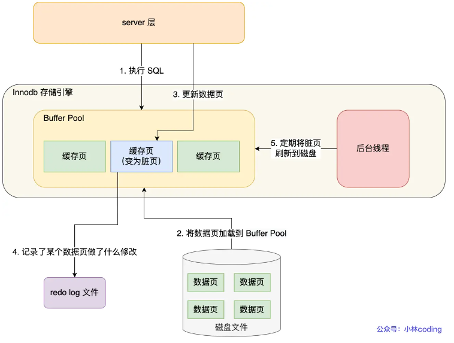
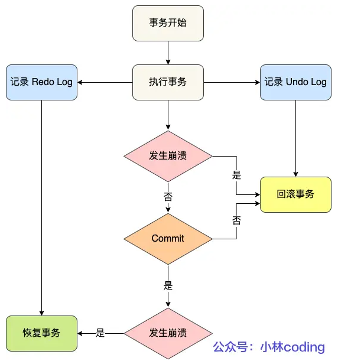
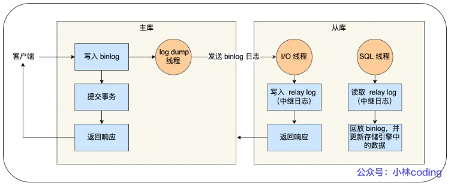

### MySql 八股

**可以按四个角度来分类索引:**

- 按 **数据结构** 分类：`B+ tree 索引` 、`Hash索引`、`Full-text索引`
- 按 **物理存储** 分类：`聚簇索引（主键索引）`、`二级索引（辅助索引）`
- 按 **字段特性** 分类：`主键索引`、`唯一索引`、`普通索引`、`前缀索引`
- 按 **字段个数** 分类：`单列索引`、`联合索引`


#### Compact 行格式长什么样？

 

#### 为什么 MySQL InnoDB 选择 B+tree 作为索引的数据结构？

***1、B+Tree vs B Tree***

对于有 N 个叶子节点的 B+Tree，其搜索复杂度为`O(logdN)`，其中 d 表示节点允许的最大子节点个数为 d 个。

在实际的应用当中， d 值是大于100的，这样就保证了，即使数据达到千万级别时，B+Tree 的高度依然维持在 3 ~ 4 层左右，也就是说一次数据查询操作只需要做 3 ~ 4 次的磁盘 I/O 操作就能查询到目标数据。

而二叉树的每个父节点的儿子节点个数只能是 2 个，意味着其搜索复杂度为 `O(logN)`，这已经比 B+Tree 高出不少，因此二叉树检索到目标数据所经历的磁盘 I/O 次数要更多。

***2、B+Tree vs 二叉树***

对于有 N 个叶子节点的 B+Tree，其搜索复杂度为`O(logdN)`，其中 d 表示节点允许的最大子节点个数为 d 个。

在实际的应用当中， d 值是大于100的，这样就保证了，即使数据达到千万级别时，B+Tree 的高度依然维持在 3~4 层左右，也就是说一次数据查询操作只需要做 3~4 次的磁盘 I/O 操作就能查询到目标数据。

而二叉树的每个父节点的儿子节点个数只能是 2 个，意味着其搜索复杂度为 `O(logN)`，这已经比 B+Tree 高出不少，因此二叉树检索到目标数据所经历的磁盘 I/O 次数要更多。

***3、B+Tree vs Hash***

Hash 在做等值查询的时候效率贼快，搜索复杂度为 O(1)。

但是 Hash 表不适合做范围查询，它更适合做等值的查询，这也是 B+Tree 索引要比 Hash 表索引有着更广泛的适用场景的原因。

#### 联合索引什么时候才能被有效利用？

> **关键** ： 利用索引的前提是索引中的 key 是有序的 

使用联合索引时，存在 **最左匹配原则**, 也就是按照最左优先的方式进行索引的匹配。

#### 索引失效的10种场景 

参考 

1. **不满足最左匹配原则**
2. **索引列上有计算**

```sql
explain select * from 某表 where id+1=2;
```

3. **索引列用了函数**

```sql
explain select * from 某表 where SUBSTR(height,1,2)=17;
```

4. **字段类型不同**

> 因为 MySQL 在遇到字符串和数字进行比较的时候, 会自动把字符串转为数字, 然后进行比较

比如

```sql
select * from user_table where phone = 1300000001
```

因为phone字段为字符串, 所以MySQL 要自动把字符串转为数字, 所以这条语句相当于:

```sql
select * from t_user where CAST(phone AS signed int) = 1300000001
```

CAST 函数作用在了 phone 字段，而phone字段是索引, 也就是对索引使用了函数, 而对索引使用函数是会导致索引失效的


5. **使用了 `select *`**

```sql
explain 
select * from 某表 where name='苏三';

```

使用`SELECT *`本身并不会直接导致联合索引的“失效”。这里的“失效”通常指的是索引没有被查询优化器选择来加速查询过程。`SELECT *`表示查询表中的所有列，它与索引是否被使用无关，而是关乎数据检索的范围和方式。

联合索引是否被有效利用，主要取决于查询的WHERE子句和ORDER BY、GROUP BY等子句中对索引列的使用情况，以及是否遵循最左前缀原则等，如前所述。只要查询条件能够匹配联合索引的定义，索引就有可能被使用，不论查询语句中是使用`SELECT *`还是显式指定列名。

然而，值得注意的是，虽然`SELECT *`不影响索引的使用，但它可能会影响查询的性能，尤其是在表中有大量列或者大文本、二进制等大数据类型列的情况下。这是因为`SELECT *`会加载表中的所有列，即使某些列的数据并未实际使用。因此，从性能优化的角度出发，推荐在查询时仅选择需要的列，而不是盲目使用`SELECT *`。

6. **like 左边包含 %** 

> **目前like查询主要有三种情况：** 1、`like '%a'`  2、`like 'a%'`  3、`like '%a%'`

```sql
explain select * from 某表
where code like '%1%';
```

7. **列对比**

```sql
explain select * from user 
where id=height
```

8. **使用 or 关键字**

> 如果使用了`or`关键字，那么它前面和后面的字段都要加索引，不然所有的索引都会失效，这是一个大坑

如：id、height 是索引，address不是

```sql
explain select * from user 
where id=1 or height='175'; # n能正常走索引
```

下面的不能走索引

```sql
explain select * from user 
where id=1 or height='175' or address='成都'; 
```

9. **not in 和 not exists**

主键字段中使用not in关键字查询数据范围，任然可以走索引。而普通索引字段使用了not in关键字查询数据范围，索引会失效 

**除此之外，如果sql语句中使用`not exists`时，索引也会失效。具体sql语句如下：**

```sql
explain select * from user  t1
where  not exists (select 1 from user t2 where t2.height=173 and t1.id=t2.id)
```

**`order by`后面如果包含了联合索引的多个排序字段，只要它们的排序规律是相同的（要么同时升序，要么同时降序），也可以走索引。**

如果`order by`语句中没有加where或limit关键字，该sql语句将不会走索引

#### MySQL 是怎么加行级锁的？

参考🚀[MySQL 是怎么加锁的？ | 小林coding (xiaolincoding.com)](https://xiaolincoding.com/mysql/lock/how_to_lock.html#唯一索引等值查询)

> 首先要明白：普通的 select 语句是不加锁的，因为是快照读。如果使用当前读的话，会进行加锁处理 (`Next-Key Lock`)， 但是 `Next-Key Lock` 在某些情况是会退化成 `记录锁` 或者 `间隙锁`。

##### 唯一索引等值查询

1. 在记录「**存在**」的情况下，因为是唯一索引，是不能再插入索引相同的记录（会报键冲突错误），所以就用不上**间隙锁**，这时候就只需要 **记录锁** 来保证这条记录不被删除！

2. 唯一索引等值查询并且查询记录「**不存在**」的场景下，在索引树找到第一条大于该查询记录的记录后，要将该记录的索引中的 `next-key lock` 会退化成「`间隙锁`」, 因为要锁住间隙，使得其他事务不能往这个间隙里面添加记录，不用 **记录锁** 的原因是，这条记录不存在，也就不用加记录锁来保证这条记录不被删除。

##### 唯一索引范围查询

当唯一索引进行范围查询时，**会对每一个扫描到的索引加 next-key 锁，然后如果遇到下面这些情况，会退化成记录锁或者间隙锁**：

- 情况一：针对「大于等于」的范围查询，因为存在等值查询的条件，那么如果等值查询的记录是存在于表中，那么该记录的索引中的 next-key 锁会**退化成记录锁**。
- 情况二：针对「小于或者小于等于」的范围查询，要看条件值的记录是否存在于表中：
  - 当条件值的记录不在表中，那么不管是「小于」还是「小于等于」条件的范围查询，**扫描到终止范围查询的记录时，该记录的索引的 next-key 锁会退化成间隙锁**，其他扫描到的记录，都是在这些记录的索引上加 next-key 锁。
  - 当条件值的记录在表中，如果是「小于」条件的范围查询，**扫描到终止范围查询的记录时，该记录的索引的 next-key 锁会退化成间隙锁**，其他扫描到的记录，都是在这些记录的索引上加 next-key 锁；如果「小于等于」条件的范围查询，扫描到终止范围查询的记录时，该记录的索引 next-key 锁不会退化成间隙锁。其他扫描到的记录，都是在这些记录的索引上加 next-key 锁。

#### 什么是 Redo Log ？



redo log 是物理日志，记录了某个数据页做了什么修改，比如**对 XXX 表空间中的 YYY 数据页 ZZZ 偏移量的地方做了AAA 更新**，每当执行一个事务就会产生这样的一条或者多条物理日志。

在事务提交时，只要先将 redo log 持久化到磁盘即可，可以不需要等到将缓存在 Buffer Pool 里的脏页数据持久化到磁盘。

当系统崩溃时，虽然脏页数据没有持久化，但是 redo log 已经持久化，接着 MySQL 重启后，可以根据 redo log 的内容，将所有数据恢复到最新的状态。

##### 被修改 Undo 页面，需要记录对应 redo log 吗？

需要的。

开启事务后，InnoDB 层更新记录前，首先要记录相应的 undo log，如果是更新操作，需要把被更新的列的旧值记下来，也就是要生成一条 undo log，undo log 会写入 Buffer Pool 中的 Undo 页面。

不过，**在内存修改该 Undo 页面后，需要记录对应的 redo log**。

#### Undo Log 和 Redo Log 有什么区别 ?

这两种日志是属于 InnoDB 存储引擎的日志，它们的区别在于：

- **redo log** 记录了此次事务「**完成后**」的数据状态，记录的是更新**之后**的值；
- **undo log** 记录了此次事务「**开始前**」的数据状态，记录的是更新**之前**的值；

事务提交之前发生了崩溃，重启后会通过 `undo log` 回滚事务，事务提交之后发生了崩溃，重启后会通过 `redo log` 恢复事务，如下图：

 

所以有了 redo log，再通过 WAL 技术，InnoDB 就可以保证即使数据库发生异常重启，之前已提交的记录都不会丢失，这个能力称为 **crash-safe**（崩溃恢复）。可以看出来， **redo log 保证了事务四大特性中的持久性**。

#### 什么是 WAL 技术 ？ 

Buffer Pool 是提高了读写效率没错，但是问题来了，Buffer Pool 是基于内存的，而内存总是不可靠，万一断电重启，还没来得及落盘的脏页数据就会丢失。

为了防止断电导致数据丢失的问题，当有一条记录需要更新的时候，InnoDB 引擎就会先更新内存（同时标记为脏页），然后将本次对这个页的修改以 redo log 的形式记录下来，**这个时候更新就算完成了**。

后续，InnoDB 引擎会在适当的时候，由后台线程将缓存在 Buffer Pool 的脏页刷新到磁盘里，这就是 **WAL （Write-Ahead Logging）技术**。

**WAL 技术指的是， MySQL 的写操作并不是立刻写到磁盘上，而是先写日志，然后在合适的时间再写到磁盘上**。

#### 说说 MySQL 中的 ACID 的具体实现 ？

在MySQL中，特别是使用InnoDB存储引擎时，ACID（原子性、一致性、隔离性、持久性）属性是通过多种机制和技术来实现的。下面是这些特性的具体实现细节：

1. **原子性(Atomicity)**

   - 实现方式：通过`undo logs`和`redo logs`。`undo logs`用于回滚事务，`redo logs`用于崩溃恢复，确保事务要么完全执行，要么完全不执行。

2. **一致性(Consistency)**

   - 实现方式：主要依靠`MVCC（多版本并发控制）`。MVCC允许读取操作看到过去的数据版本，同时不影响正在进行的写操作，保持数据的一致性。

3. **隔离性(Isolation)**

   - 实现方式：通过不同级别的锁定机制和`MVCC`。InnoDB支持四种隔离级别，每个级别决定了事务之间如何交互，以及读取数据的可见性。

   | **隔离级别**   | 效果                                                         |
   | -------------- | ------------------------------------------------------------ |
   | 读未提交（RU） | 一个事务还没提交时，它做的变更就能被别的事务看到。（别的事务指同一时间进行的增删改查操作） |
   | 读提交（RC）   | 一个事务提交（commit）之后，它做的变更才会被其他事务看到。每次查询都会生成一个新的 `read view` |
   | 可重复读（RR） | 一个事务执行过程中看到的数据，总是跟这个事务在启动时看到的数据是一致的。 当然在可重复读隔离级别下，未提交变更对其他事务也是不可见的。在事务开始时创建一次 `read view` |
   | 串行化（S）    | 正如物理书上写的，串行是单线路，顾名思义在MySQL中同一时刻只允许单个事务执行，“写”会加“写锁”，“读”会加“读锁”。当出现读写锁冲突的时候，后访问的事务必须等前一个事务执行完成，才能继续执行。 |

4. **持久性(Durability)**

   - 实现方式：主要依赖于`redo logs`和`检查点(checkpoint)`。`redo logs`确保事务提交后数据的持久性，`检查点`定期将内存中的数据同步到磁盘，减少恢复时间。

简单来说，原子性通过`undo`和`redo`日志保证，一致性由`MVCC`支持，隔离性通过锁定和`MVCC`的不同组合实现，而持久性则由`redo logs`和定期的`检查点`机制来保障。

#### redo log 要写到磁盘，数据也要写磁盘，为什么要多此一举？

写入 redo log 的方式使用了追加操作， 所以磁盘操作是**顺序写**，而写入数据需要先找到写入位置，然后才写到磁盘，所以磁盘操作是**随机写**。

磁盘的「顺序写 」比「随机写」 高效的多，因此 redo log 写入磁盘的开销更小。

针对「顺序写」为什么比「随机写」更快这个问题，可以比喻为你有一个本子，按照顺序一页一页写肯定比写一个字都要找到对应页写快得多。

可以说这是 WAL 技术的另外一个优点：**MySQL 的写操作从磁盘的「随机写」变成了「顺序写」**，提升语句的执行性能。这是因为 MySQL 的写操作并不是立刻更新到磁盘上，而是先记录在日志上，然后在合适的时间再更新到磁盘上 。

至此， 针对为什么需要 redo log 这个问题我们有两个答案：

- **实现事务的持久性，让 MySQL 有 crash-safe 的能力**，能够保证 MySQL 在任何时间段突然崩溃，重启后之前已提交的记录都不会丢失；
- **将写操作从「随机写」变成了「顺序写」**，提升 MySQL 写入磁盘的性能。

#### 产生的 redo log 是直接写入磁盘的吗？

不是的。

实际上， 执行一个事务的过程中，产生的 redo log 也不是直接写入磁盘的，因为这样会产生大量的 I/O 操作，而且磁盘的运行速度远慢于内存。

所以，redo log 也有自己的缓存—— **redo log buffer**，每当产生一条 redo log 时，会先写入到 redo log buffer，后续在持久化到磁盘。

#### redo log 什么时候刷盘？

缓存在 redo log buffer 里的 redo log 还是在内存中，它什么时候刷新到磁盘？

主要有下面几个时机：

- MySQL 正常关闭时；
- 当 redo log buffer 中记录的写入量大于 redo log buffer 内存空间的一半时，会触发落盘；
- InnoDB 的后台线程每隔 1 秒，将 redo log buffer 持久化到磁盘。
- 每次事务提交时都将缓存在 redo log buffer 里的 redo log 直接持久化到磁盘（这个策略可由 innodb_flush_log_at_trx_commit 参数控制，下面会说）。

#### innodb_flush_log_at_trx_commit 参数控制的是什么？

单独执行一个更新语句的时候，InnoDB 引擎会自己启动一个事务，在执行更新语句的过程中，生成的 redo log 先写入到 redo log buffer 中，然后等事务提交的时候，再将缓存在 redo log buffer 中的 redo log 按组的方式「顺序写」到磁盘。

上面这种 redo log 刷盘时机是在事务提交的时候，这个默认的行为。

除此之外，InnoDB 还提供了另外两种策略，由参数 `innodb_flush_log_at_trx_commit` 参数控制，可取的值有：0、1、2，默认值为 1，这三个值分别代表的策略如下：

- 当设置该**参数为 0 时**，表示每次事务提交时 ，还是**将 redo log 留在 redo log buffer 中** ，该模式下在事务提交时不会主动触发写入磁盘的操作。
- 当设置该**参数为 1 时**，表示每次事务提交时，都**将缓存在 redo log buffer 里的 redo log 直接持久化到磁盘**，这样可以保证 MySQL 异常重启之后数据不会丢失。
- 当设置该**参数为 2 时**，表示每次事务提交时，都只是缓存在 redo log buffer 里的 redo log **写到 redo log 文件，注意写入到「 redo log 文件」并不意味着写入到了磁盘**，因为操作系统的文件系统中有个 Page Cache（如果你想了解 Page Cache，可以看[这篇 (opens new window)](https://xiaolincoding.com/os/6_file_system/pagecache.html)），Page Cache 是专门用来缓存文件数据的，所以写入「 redo log文件」意味着写入到了操作系统的文件缓存。


加入了后台现线程后，innodb_flush_log_at_trx_commit 的刷盘时机如下图：


#### Redo Log 和 BinLog 的区别 ？

这两个日志有四个区别。

*1、**适用对象不同：***

- binlog 是 MySQL 的 Server 层实现的日志，所有存储引擎都可以使用；
- redo log 是 Innodb 存储引擎实现的日志；

*2、**文件格式不同：***

- binlog 有 3 种格式类型，分别是 STATEMENT（默认格式）、ROW、 MIXED，区别如下：
  - STATEMENT：每一条修改数据的 SQL 都会被记录到 binlog 中（相当于记录了逻辑操作，所以针对这种格式， binlog 可以称为逻辑日志），主从复制中 slave 端再根据 SQL 语句重现。但 STATEMENT 有动态函数的问题，比如你用了 uuid 或者 now 这些函数，你在主库上执行的结果并不是你在从库执行的结果，这种随时在变的函数会导致复制的数据不一致；
  - ROW：记录行数据最终被修改成什么样了（这种格式的日志，就不能称为逻辑日志了），不会出现 STATEMENT 下动态函数的问题。但 ROW 的缺点是每行数据的变化结果都会被记录，比如执行批量 update 语句，更新多少行数据就会产生多少条记录，使 binlog 文件过大，而在 STATEMENT 格式下只会记录一个 update 语句而已；
  - MIXED：包含了 STATEMENT 和 ROW 模式，它会根据不同的情况自动使用 ROW 模式和 STATEMENT 模式；
- redo log 是物理日志，记录的是在某个数据页做了什么修改，比如对 XXX 表空间中的 YYY 数据页 ZZZ 偏移量的地方做了AAA 更新；

*3、**写入方式不同**：*

- binlog 是追加写，写满一个文件，就创建一个新的文件继续写，不会覆盖以前的日志，保存的是全量的日志。
- redo log 是循环写，日志空间大小是固定，全部写满就从头开始，保存未被刷入磁盘的脏页日志。

*4、**用途不同：***

- binlog 用于备份恢复、主从复制；
- redo log 用于掉电等故障恢复。

#### 主从复制是怎么实现？

MySQL 的主从复制依赖于 binlog ，也就是记录 MySQL 上的所有变化并以二进制形式保存在磁盘上。复制的过程就是将 binlog 中的数据从主库传输到从库上。

这个过程一般是**异步**的，也就是主库上执行事务操作的线程不会等待复制 binlog 的线程同步完成。



MySQL 集群的主从复制过程梳理成 3 个阶段：

- **写入 Binlog**：主库写 binlog 日志，提交事务，并更新本地存储数据。
- **同步 Binlog**：把 binlog 复制到所有从库上，每个从库把 binlog 写到暂存日志中。
- **回放 Binlog**：回放 binlog，并更新存储引擎中的数据。

具体详细过程如下：

- MySQL 主库在收到客户端提交事务的请求之后，会先写入 binlog，再提交事务，更新存储引擎中的数据，事务提交完成后，返回给客户端“操作成功”的响应。
- 从库会创建一个专门的 I/O 线程，连接主库的 log dump 线程，来接收主库的 binlog 日志，再把 binlog 信息写入 relay log 的中继日志里，再返回给主库“复制成功”的响应。
- 从库会创建一个用于回放 binlog 的线程，去读 relay log 中继日志，然后回放 binlog 更新存储引擎中的数据，最终实现主从的数据一致性。

在完成主从复制之后，你就可以在写数据时只写主库，在读数据时只读从库，这样即使写请求会锁表或者锁记录，也不会影响读请求的执行。

#### update 语句的执行过程

当优化器分析出成本最小的执行计划后，执行器就按照执行计划开始进行更新操作。

具体更新一条记录 `UPDATE t_user SET name = 'xiaolin' WHERE id = 1;` 的流程如下:

1. 执行器负责具体执行，会调用存储引擎的接口，通过主键索引树搜索获取 id = 1 这一行记录：
   - 如果 id=1 这一行所在的数据页本来就在 buffer pool 中，就直接返回给执行器更新；
   - 如果记录不在 buffer pool，将数据页从磁盘读入到 buffer pool，返回记录给执行器。
2. 执行器得到聚簇索引记录后，会看一下更新前的记录和更新后的记录是否一样：
   - 如果一样的话就不进行后续更新流程；
   - 如果不一样的话就把更新前的记录和更新后的记录都当作参数传给 InnoDB 层，让 InnoDB 真正的执行更新记录的操作；
3. 开启事务， InnoDB 层更新记录前，首先要记录相应的 undo log，因为这是更新操作，需要把被更新的列的旧值记下来，也就是要生成一条 undo log，undo log 会写入 Buffer Pool 中的 Undo 页面，不过在内存修改该 Undo 页面后，需要记录对应的 redo log。
4. InnoDB 层开始更新记录，会先更新内存（同时标记为脏页），然后将记录写到 redo log 里面，这个时候更新就算完成了。为了减少磁盘I/O，不会立即将脏页写入磁盘，后续由后台线程选择一个合适的时机将脏页写入到磁盘。这就是 **WAL 技术**，MySQL 的写操作并不是立刻写到磁盘上，而是先写 redo 日志，然后在合适的时间再将修改的行数据写到磁盘上。
5. 至此，一条记录更新完了。
6. 在一条更新语句执行完成后，然后开始记录该语句对应的 binlog，此时记录的 binlog 会被保存到 binlog cache，并没有刷新到硬盘上的 binlog 文件，在事务提交时才会统一将该事务运行过程中的所有 binlog 刷新到硬盘。
7. 事务提交，剩下的就是「两阶段提交」的事情了，接下来就讲这个。

#### 为什么需要两阶段提交？

事务提交后，redo log 和 binlog 都要持久化到磁盘，但是这两个是独立的逻辑，可能出现半成功的状态，这样就造成两份日志之间的逻辑不一致。

举个例子，假设 id = 1 这行数据的字段 name 的值原本是 'jay'，然后执行 `UPDATE t_user SET name = 'xiaolin' WHERE id = 1;` 如果在持久化 redo log 和 binlog 两个日志的过程中，出现了半成功状态，那么就有两种情况：

- **如果在将 redo log 刷入到磁盘之后， MySQL 突然宕机了，而 binlog 还没有来得及写入**。MySQL 重启后，通过 redo log 能将 Buffer Pool 中 id = 1 这行数据的 name 字段恢复到新值 xiaolin，但是 binlog 里面没有记录这条更新语句，在主从架构中，binlog 会被复制到从库，由于 binlog 丢失了这条更新语句，从库的这一行 name 字段是旧值 jay，与主库的值不一致性；
- **如果在将 binlog 刷入到磁盘之后， MySQL 突然宕机了，而 redo log 还没有来得及写入**。由于 redo log 还没写，崩溃恢复以后这个事务无效，所以 id = 1 这行数据的 name 字段还是旧值 jay，而 binlog 里面记录了这条更新语句，在主从架构中，binlog 会被复制到从库，从库执行了这条更新语句，那么这一行 name 字段是新值 xiaolin，与主库的值不一致性；

可以看到，在持久化 redo log 和 binlog 这两份日志的时候，如果出现半成功的状态，就会造成主从环境的数据不一致性。这是因为 redo log 影响主库的数据，binlog 影响从库的数据，所以 redo log 和 binlog 必须保持一致才能保证主从数据一致。

**MySQL 为了避免出现两份日志之间的逻辑不一致的问题，使用了「两阶段提交」来解决**，两阶段提交其实是分布式事务一致性协议，它可以保证多个逻辑操作要不全部成功，要不全部失败，不会出现半成功的状态。

**两阶段提交把单个事务的提交拆分成了 2 个阶段，分别是「准备（Prepare）阶段」和「提交（Commit）阶段」**，每个阶段都由协调者（Coordinator）和参与者（Participant）共同完成。注意，不要把提交（Commit）阶段和 commit 语句混淆了，commit 语句执行的时候，会包含提交（Commit）阶段。

举个拳击比赛的例子，两位拳击手（参与者）开始比赛之前，裁判（协调者）会在中间确认两位拳击手的状态，类似于问你准备好了吗？

- <font color='#d2b42c'>准备阶段</font>：裁判（协调者）会依次询问两位拳击手（参与者）是否准备好了，然后拳击手听到后做出应答，如果觉得自己准备好了，就会跟裁判说准备好了；如果没有自己还没有准备好（比如拳套还没有带好），就会跟裁判说还没准备好。
- <font color='#d2b42c'>提交阶段</font>：如果两位拳击手（参与者）都回答准备好了，裁判（协调者）宣布比赛正式开始，两位拳击手就可以直接开打；如果任何一位拳击手（参与者）回答没有准备好，裁判（协调者）会宣布比赛暂停，对应事务中的回滚操作。

#### MySQL 磁盘 I/O 很高，有什么优化方法？

现在我们知道事务在提交的时候，需要将 binlog 和 redo log 持久化到磁盘，那么如果出现 MySQL 磁盘 I/O 很高的现象，我们可以通过控制以下参数，来 “延迟” binlog 和 redo log 刷盘的时机，从而降低磁盘 I/O 的频率：

- 设置组提交的两个参数： binlog_group_commit_sync_delay 和 binlog_group_commit_sync_no_delay_count 参数，延迟 binlog 刷盘的时机，从而减少 binlog 的刷盘次数。这个方法是基于“额外的故意等待”来实现的，因此可能会增加语句的响应时间，但即使 MySQL 进程中途挂了，也没有丢失数据的风险，因为 binlog 早被写入到 page cache 了，只要系统没有宕机，缓存在 page cache 里的 binlog 就会被持久化到磁盘。
- 将 sync_binlog 设置为大于 1 的值（比较常见是 100~1000），表示每次提交事务都 write，但累积 N 个事务后才 fsync，相当于延迟了 binlog 刷盘的时机。但是这样做的风险是，主机掉电时会丢 N 个事务的 binlog 日志。
- 将 innodb_flush_log_at_trx_commit 设置为 2。表示每次事务提交时，都只是缓存在 redo log buffer 里的 redo log 写到 redo log 文件，注意写入到「 redo log 文件」并不意味着写入到了磁盘，因为操作系统的文件系统中有个 Page Cache，专门用来缓存文件数据的，所以写入「 redo log文件」意味着写入到了操作系统的文件缓存，然后交由操作系统控制持久化到磁盘的时机。但是这样做的风险是，主机掉电的时候会丢数据。

#### 为什么要有 Buffer Pool ？

虽然说 MySQL 的数据是存储在磁盘里的，但是也不能每次都从磁盘里面读取数据，这样性能是极差的。

要想提升查询性能，加个缓存就行了嘛。所以，当数据从磁盘中取出后，缓存内存中，下次查询同样的数据的时候，直接从内存中读取。

为此，Innodb 存储引擎设计了一个**缓冲池（Buffer Pool）**，来提高数据库的读写性能。

##### 什么是预读失败？

先来说说 MySQL 的预读机制。程序是有空间局部性的，靠近当前被访问数据的数据，在未来很大概率会被访问到。

所以，MySQL 在加载数据页时，会提前把它相邻的数据页一并加载进来，目的是为了减少磁盘 IO。

但是可能这些<font color='#d2b42c'>被提前加载进来的数据页，并没有被访问</font>，相当于这个预读是白做了，这个就是<font color='#d2b42c'>预读失效</font>。

如果使用简单的 LRU 算法，就会把预读页放到 LRU 链表头部，而当 Buffer Pool空间不够的时候，还需要把末尾的页淘汰掉。

如果这些预读页如果一直不会被访问到，就会出现一个很奇怪的问题，不会被访问的预读页却占用了 LRU 链表前排的位置，而末尾淘汰的页，可能是频繁访问的页，这样就大大降低了缓存命中率。

##### 怎么解决预读失效而导致缓存命中率降低的问题？

我们不能因为害怕预读失效，而将预读机制去掉，大部分情况下，局部性原理还是成立的。

要避免预读失效带来影响，最好就是**让预读的页停留在 Buffer Pool 里的时间要尽可能的短，让真正被访问的页才移动到 LRU 链表的头部，从而保证真正被读取的热数据留在 Buffer Pool 里的时间尽可能长**。

那到底怎么才能避免呢？

MySQL 是这样做的，它改进了 LRU 算法，将 LRU 划分了 2 个区域：**old 区域 和 young 区域**。

young 区域在 LRU 链表的前半部分，old 区域则是在后半部分，如下图：


old 区域占整个 LRU 链表长度的比例可以通过 `innodb_old_blocks_pct` 参数来设置，默认是 37，代表整个 LRU 链表中 young 区域与 old 区域比例是 63:37。

**划分这两个区域后，预读的页就只需要加入到 old 区域的头部，当页被真正访问的时候，才将页插入 young 区域的头部**。如果预读的页一直没有被访问，就会从 old 区域移除，这样就不会影响 young 区域中的热点数据。

虽然通过划分 old 区域 和 young 区域避免了预读失效带来的影响，但是还有个问题无法解决，那就是 Buffer Pool 污染的问题。

##### 什么是 Buffer Pool 污染问题 ？

当某一个 SQL 语句<font color='#d2b42c'>扫描了大量的数据</font>时，在 Buffer Pool 空间比较有限的情况下，可能会将 <font color='#d2b42c'>Buffer Pool 里的所有页都替换出去，导致大量热数据被淘汰了</font>，等这些热数据又被再次访问的时候，由于缓存未命中，就会产生大量的磁盘 IO，MySQL 性能就会急剧下降，这个过程被称为**<font color='#d2b42c'>Buffer Pool 污染</font>**。

注意， Buffer Pool 污染并不只是查询语句查询出了大量的数据才出现的问题，即使查询出来的结果集很小，也会造成 Buffer Pool 污染。

比如，在一个数据量非常大的表，执行了这条语句：

```sql
select * from t_user where name like "%xiaolin%";
```

可能这个查询出来的结果就几条记录，但是由于这条语句会发生索引失效，所以这个查询过程是全表扫描的，接着会发生如下的过程：

- 从磁盘读到的页加入到 LRU 链表的 old 区域头部；
- 当从页里读取行记录时，也就是页被访问的时候，就要将该页放到 young 区域头部；
- 接下来拿行记录的 name 字段和字符串 xiaolin 进行模糊匹配，如果符合条件，就加入到结果集里；
- 如此往复，直到扫描完表中的所有记录。

经过这一番折腾，原本 young 区域的热点数据都会被替换掉。

##### 怎么解决出现 Buffer Pool 污染而导致缓存命中率下降的问题？

像前面这种全表扫描的查询，很多缓冲页其实只会被访问一次，但是它却只因为被访问了一次而进入到 young 区域，从而导致热点数据被替换了。

LRU 链表中 young 区域就是热点数据，只要我们提高进入到 young 区域的门槛，就能有效地保证 young 区域里的热点数据不会被替换掉。

MySQL 是这样做的，进入到 young 区域条件增加了一个**停留在 old 区域的时间判断**。

具体是这样做的，在对某个处在 old 区域的缓存页进行第一次访问时，就在它对应的控制块中记录下来这个访问时间：

- 如果后续的访问时间与第一次访问的时间**在某个时间间隔内**，那么**该缓存页就不会被从 old 区域移动到 young 区域的头部**；
- 如果后续的访问时间与第一次访问的时间**不在某个时间间隔内**，那么**该缓存页移动到 young 区域的头部**；

这个间隔时间是由 `innodb_old_blocks_time` 控制的，默认是 1000 ms。

也就说，**只有同时满足「被访问」与「在 old 区域停留时间超过 1 秒」两个条件，才会被插入到 young 区域头部**，这样就解决了 Buffer Pool 污染的问题 。

另外，MySQL 针对 young 区域其实做了一个优化，为了防止 young 区域节点频繁移动到头部。young 区域前面 1/4 被访问不会移动到链表头部，只有后面的 3/4被访问了才会。

#### 脏页什么时候会刷入磁盘 ？

引入了 Buffer Pool 后，当修改数据时，首先是修改 Buffer Pool 中数据所在的页，然后将其页设置为脏页，但是磁盘中还是原数据。

因此，脏页需要被刷入磁盘，保证缓存和磁盘数据一致，但是若每次修改数据都刷入磁盘，则性能会很差，因此一般都会在一定时机进行批量刷盘。

可能大家担心，如果在脏页还没有来得及刷入到磁盘时，MySQL 宕机了，不就丢失数据了吗？

这个不用担心，InnoDB 的更新操作采用的是 Write Ahead Log 策略，即先写日志，再写入磁盘，通过 redo log 日志让 MySQL 拥有了崩溃恢复能力。

下面几种情况会触发脏页的刷新：

- 当 redo log 日志满了的情况下，会主动触发脏页刷新到磁盘；
- Buffer Pool 空间不足时，需要将一部分数据页淘汰掉，如果淘汰的是脏页，需要先将脏页同步到磁盘；
- MySQL 认为空闲时，后台线程会定期将适量的脏页刷入到磁盘；
- MySQL 正常关闭之前，会把所有的脏页刷入到磁盘；

在我们开启了慢 SQL 监控后，如果你发现**「偶尔」会出现一些用时稍长的 SQL**，这可能是因为脏页在刷新到磁盘时可能会给数据库带来性能开销，导致数据库操作抖动。

如果间断出现这种现象，就需要调大 Buffer Pool 空间或 redo log 日志的大小。

#### 缓存池（Buffer Pool）总结 

Innodb 存储引擎设计了一个**缓冲池（Buffer Pool）**，来提高数据库的读写性能。

Buffer Pool 以页为单位缓冲数据，可以通过 `innodb_buffer_pool_size` 参数调整缓冲池的大小，默认是 128 M。

Innodb 通过三种链表来管理缓页：

- Free List （空闲页链表），管理空闲页；
- Flush List （脏页链表），管理脏页；
- LRU List，管理脏页+干净页，将最近且经常查询的数据缓存在其中，而不常查询的数据就淘汰出去。；

InnoDB 对 LRU 做了一些优化，我们熟悉的 LRU 算法通常是将最近查询的数据放到 LRU 链表的头部，而 InnoDB 做 2 点优化：

- 将 LRU 链表 分为**young 和 old 两个区域**，加入缓冲池的页，优先插入 old 区域；页被访问时，才进入 young 区域，目的是为了解决预读失效的问题。
- 当**「页被访问」且「 old 区域停留时间超过 `innodb_old_blocks_time` 阈值（默认为1秒）」**时，才会将页插入到 young 区域，否则还是插入到 old 区域，目的是为了解决批量数据访问，大量热数据淘汰的问题。

可以通过调整 `innodb_old_blocks_pct` 参数，设置 young 区域和 old 区域比例。

在开启了慢 SQL 监控后，如果你发现「偶尔」会出现一些用时稍长的 SQL，这可因为脏页在刷新到磁盘时导致数据库性能抖动。如果在很短的时间出现这种现象，就需要调大 Buffer Pool 空间或 redo log 日志的大小。
