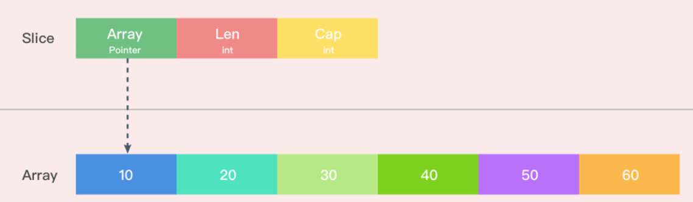

### Go语言基础

#### Go语言特点和优势

1. **并发支持**：Go语言内置了对并发的支持，通过Goroutines和Channels，可以轻松地实现并发编程，而不需要复杂的线程管理。
2. **内存管理**：Go语言拥有自动垃圾回收机制，帮助开发者管理内存，避免了内存泄漏等问题。
3. **跨平台**：Go语言支持跨平台编译，可以轻松地在不同的操作系统上运行。
4. **部署简单**：Go语言编写的程序编译后生成单一的可执行文件，部署简单，不需要复杂的环境配置。
5. **性能**：Go语言的性能接近C语言，非常适合需要高性能的应用程序。
6. **安全性**：Go语言的设计注重安全性，例如内置的类型系统和编译时检查，有助于减少运行时错误。
7. **错误处理**：Go语言的错误处理机制简单有效，通过返回值来处理错误，避免了复杂的异常处理。
8. **简洁性**：Go语言的语法非常简洁，易于学习和使用。它没有传统C语言中的头文件、指针运算等复杂概念。
9. **编译速度**：Go语言的编译速度非常快，这使得开发周期大大缩短，提高了开发效率。
10. **静态类型系统**：Go拥有静态类型系统，这意味着类型检查在编译时进行，而不是在运行时，这有助于编译器快速完成类型检查。(安全 , 在编译时就检查出错误)

>  Go语言的这些特点和优势使其在云计算、微服务架构、网络编程、分布式系统等领域得到了广泛的应用。

#### Go string 和 []byte 的区别

如果需要频繁地修改字符串内容, 或者处理二进制数据, 使用`[]byte` 更为合适 。如果字符串内容基本保持不变，并且主要处理文本数据，那么使用`string` 更为方便. 

1. **不可变性**

`string` 是不可变的数据类型，⼀旦创建就不能被修改。任何修改  `string` 的操作都会产⽣⼀个新的  `string` ， ⽽原始的 `string` 保持不变。相⽐之下， `[]byte` 是可变的切⽚，可以通过索引直接修改切⽚中的元素。

2. **使用场景**

- `[]byte`常用于底层的数据处理，如文件I/O、网络通信等，这些操作通常需要处理字节流。

- `string`类型在Go中常用于处理文本数据，它提供了丰富的字符串操作方法，如切片、拼接、搜索、替换等。
- 由于`[]byte`是可变的，可以直接修改其内容，这在处理大量数据时可以提高效率，避免不必要的内存分配。

3. **内存问题**

- `string` 类型在内存中以UTF-8编码存储字符，这意味着一个`string`可能由多个字节组成，具体取决于字符的Unicode编码。

- `[]byte`类型在内存中存储的是原始字节数据，没有字符编码的概念，因此它可以用来表示任意的二进制数据，包括文本文件、图片、音频等。

> 在处理文本数据时，通常推荐使用 `string` 类型，因为它提供了更好的可读性和方便的字符串操作方法。而在底层操作或者需要处理字节流时，使用`[]byte`可以提供更高的灵活性和效率。

#### make 和 new 的区别

**主要区别:** 

1. **返回类型:** `new` 返回指针类型，而 `make` 返回具体类型。
2. **初始化:** `new` 分配的内存自动初始化为相应类型的零值，而 `make` 分配的数据结构（如切片、映射）会根据其类型进行特殊初始化。
3. **适用类型**：`new` 用于分配具有固定大小的类型，如结构体、数组；`make` 用于分配引用类型，如切片、映射、通道。

**使用场景:**

- 当你需要一个初始化为零值的固定大小对象时，使用 `new`。
- 当你需要一个动态大小的数据结构时，使用 `make`。

**示例**

```go
var p *int = new(int)  // 分配了一个int类型的零值，并返回其指针

s := make([]int, 5)  // 分配了一个包含5个int类型零值的切片

m := make(map[string]int)  // 分配了一个空的映射，其内部的键值对需要显式添加

ch := make(chan int)  // 分配了一个用于int类型元素的通道
```

**总结**:

- new只⽤于分配内存，返回⼀个指向地址的指针。它为每个新类型分配⼀⽚内存，初始化为0且返回类型*T的 内存地址，它相当于&T{}
- make只可⽤于slice,map,channel的初始化,返回的是引⽤

#### 数组和切片的区别

**数组**

1. **固定长度**：数组的长度是固定的，一旦声明，就不能改变。
2. **分配方式**：数组通常在栈上分配，这意味着它们的内存分配是静态的，适用于大小已知且不变的情况。
3. **声明方式**：声明数组时需要指定长度，例如 `var arr [5]int`。
4. **传递方式**：数组作为参数传递给函数时，实际上是值传递，这意味着整个数组的副本会被传递。
5. **内置函数**：对数组的操作通常是通过内置函数进行的，如 `copy()`、`append()`。

**切片**

1. **动态长度**：切片的长度是动态的，可以增长和缩小。
2. **底层数组**：切片基于数组实现，它是一个包含指向底层数组的**指针**、**长度**和**容量**的结构体。
3. **声明方式**：声明切片时不需要指定长度，例如 `var slice []int`。
4. **传递方式**：切片作为参数传递给函数时，是引用传递，即传递的是底层数组的指针。
5. **内置方法**：切片提供了许多内置方法，如 `append()`、`copy()`、`delete()` 和切片操作 `slice[low:high]`。

```go
// 创建切⽚
slice1 := make([]int, 3, 5)  // ⻓度为3，容量为5的切⽚
slice2 := []int{1, 2, 3}     // 直接初始化切⽚
slice3 := arr1[:]            // 从数组截取切⽚

```

#### 切片是如何扩容的

> 切片扩容时会创建一个新的底层数组，并将原有的元素拷贝到新的数组中。这个过程可能会影响性能，尤其是当切片很大时。因此，在使用切片时如果能预估切片的大小，最好提前分配好足够的容量，以减少不必要的扩容操作。

**切片扩容具体过程：**

1. 对于长度小于 1024 的切片,新容量的大小为旧容量的 2 倍。
2. 对于长度大于等于 1024 的切片,新容量的大小为旧容量的 1.25 倍。

**切片共享：**

- 当其中一个切片扩容时,会创建一个新的内存空间,不会影响其他共享该内存空间的切片。
- 切片是引用类型,多个切片可以共享同一块内存空间。

#### 扩容前后的Slice是一样的吗

如果扩容后的容量仍然能够容纳新元素，系统会尽量在原地进⾏扩容，否则会分配⼀个新的数组，将原有元素复制到新数组中。

#### go中 Slice 的底层实现

切⽚本身并不是动态数组或者数组指针。它内部实现的数据结构通过指针引⽤底层数组，设定相关属性将数据读写操作限定在指定的区域内。切⽚本身是⼀ 个只读对象，其⼯作机制类似数组指针的⼀种封装。 主要通过⼀个结构体来表示，该结构体包含了以下三个字段

```go
type slice struct {
    array unsafe.Pointer // 指向底层数组的指针
    len   int        // 切⽚的当前⻓度        
    cap   int        // 切⽚的容量
}
```

#### Go语言参数传递

对于基本数据类型（如整数、浮点数、布尔值等）和结构体，传递的是值的副本，修改形参的值不会影响实参。

1. **值传递**:
   - 这是 Go 语言的默认传递方式。
   - 当函数接收一个值类型参数(如 int、float、string 等)时,实参的值会被复制一份传递给形参。
   - 在函数内部对形参的修改不会影响到实参。

2. **引用传递**:

   - Go 语言中使用指针来实现引用传递。

   - 当函数接收一个指针类型参数时,实参的地址会被传递给形参。

   - 在函数内部通过形参指针可以修改实参的值。

3. **slice 和 map 传递**:

   - slice 和 map 是引用类型,它们的传递方式介于值传递和引用传递之间。

   - 当函数接收 slice 或 map 参数时,实参的引用会被传递给形参。

   - 在函数内部对形参的修改会影响到实参,因为它们共享同一个底层数据结构。

4. **可变参数**:

   - Go 语言支持可变参数函数,即函数可以接收任意数量的参数。

   - 可变参数使用 `...type` 的形式声明,type 是参数的类型。

   - 在函数内部,可变参数会被转换成一个 slice 类型。

#### Go map是有序的还是无序的？

Go语⾔中， `map` 是⼀种⽤于存储键值对的集合类型。它是⼀种⽆序的集合，其中每个元素都由⼀个唯⼀的键和对 应的值组成。当 `map` 的元素数量达到⼀定阈值时，Go语⾔会动态调整 `map` 的⼤⼩。

这是因为`map`的实现采⽤了散列表（hash table）的数据结构。散列表通过哈希函数将键映射到存储桶（bucket） 散列表中的存储桶是⽆序的，它们并不保证元素按照特定顺序存储。

#### Go语言中 map 的底层实现原理

Go 语言中的 map 底层是使用哈希表(hash table)实现的。具体的实现原理如下:

1. **数组和链表**:
   - `map` 底层由一个数组和一个链表组成。
   - 数组用于存储 key-value 对,链表用于解决哈希冲突。
2. **哈希冲突处理**:
   - 当两个 key 通过哈希函数映射到同一个数组索引时,就会发生哈希冲突。
   - Go 语言的 map 使用链表来解决哈希冲突。在同一个数组索引位置,key-value 对会被链接成一个单向链表。
3. **删除操作**:
   - 当删除一个 key-value 对时,map 并不会真正从底层数组中删除该元素。
   - 而是将该元素标记为"deleted",并在下次扩容时,将这些"deleted"元素一并清理掉。
4. **遍历操作**:
   - 当遍历 map 时,Go 语言会按照 key 的哈希值顺序返回 key-value 对。
   - 但这个顺序并不是固定的,因为 map 的实现依赖于底层数组的索引位置。
5. **散列表(hash table)**: Go 语言中的 map 底层是基于散列表这种数据结构实现的。散列表是一种用于实现字典结构的数据结构。
6. **哈希函数**: 散列表使用一个哈希函数将 key 映射到存储桶(bucket)中。这个哈希函数的作用是尽可能均匀地分布 key,减少哈希冲突的概率。
7. **存储桶(bucket)**: 每个存储桶存储一个链表或红黑树,用于处理哈希冲突。当两个 key 通过哈希函数映射到同一个存储桶时,就会发生哈希冲突,需要使用链表或红黑树来解决。
8. **存储桶数量 和 扩容**: 
   - 存储桶的数量是固定的,由 map 的大小和负载因子来确定。负载因子是指 map 中元素个数与存储桶数量的比值。当负载因子超过一定阈值时,map 会触发扩容,创建更多的存储桶来存储元素。
   - 扩容时,map 会创建一个更大的数组,并将原有的 key-value 对迁移到新的数组中。

Go 语言 map 的底层实现采用了散列表的思想,通过哈希函数将 key 映射到固定数量的存储桶中,并使用链表或红黑树来解决哈希冲突。这种实现方式可以提供快速的查找、插入和删除操作。

#### map 的扩容

1. **计算新的存储桶数量：**存储桶的数量是固定的,由 map 的大小和负载因子来确定。负载因子是指 map 中元素个数与存储桶数量的比值。当负载因子超过一定阈值时,map 会触发扩容,创建更多的存储桶来存储元素。

2. **分配新的存储桶和散列数组：**创建新的存储桶和散列数组，⼤⼩为新的存储桶数量。这个过程会涉及到内存分 配。

3. **重新散列元素：**遍历当前 map 的每个存储桶，将其中的元素重新散列到新的存储桶中。这⼀步是为了保持元 素在新的存储桶中的顺序
4.  **切换到新的存储桶和散列数组：**将 map 的内部数据结构指向新的存储桶和散列数组。这个过程是原⼦的，以 确保在切换期间不会影响并发访问
5.  **释放旧的存储桶和散列数组：**释放旧的存储桶和散列数组的内存空间。这个过程是为了避免内存泄漏。

#### 如何按特定顺序遍历 map

1. **使用 map 的 keys 或 values 切片并排序**
   - 首先使用 `map[key]` 或 `map.Values()` 获取 map 的 key 或 value 切片。
   - 然后使用 `sort.Strings()` 或 `sort.Ints()` 等函数对切片进行排序。
   - 最后遍历排序后的切片,根据 key 或 value 从 map 中获取对应的值。

```go
m := map[string]int{"apple": 2, "banana": 3, "cherry": 1}

// 按 key 排序
keys := make([]string, 0, len(m))
for k := range m {
    keys = append(keys, k)
}
sort.Strings(keys)
for _, k := range keys {
    fmt.Printf("%s: %d\n", k, m[k])
}

// 按 value 排序
values := make([]int, 0, len(m))
for _, v := range m {
    values = append(values, v)
}
sort.Ints(values)
for _, v := range values {
    for k, vv := range m {
        if vv == v {
            fmt.Printf("%s: %d\n", k, v)
            delete(m, k) // 删除已遍历的元素
            break
        }
    }
}
```

2. **使用自定义的排序函数**:

- 如果需要按照特定的顺序遍历 map,可以自定义一个排序函数,然后使用该函数对 key 或 value 进行排序。

```go
type kv struct {
    Key   string
    Value int
}

m := map[string]int{"apple": 2, "banana": 3, "cherry": 1}
var kvs []kv
for k, v := range m {
    kvs = append(kvs, kv{k, v})
}
sort.Slice(kvs, func(i, j int) bool {
    return kvs[i].Value < kvs[j].Value
})
for _, kv := range kvs {
    fmt.Printf("%s: %d\n", kv.Key, kv.Value)
}
```

#### Go 里面的 map 的并发安全的吗？如何并发安全?

Go 中的 map 是非并发安全的。当多个 `goroutine` 同时访问同一个 map 时,可能会出现数据竞争,导致程序出现意料之外的行为。

要让 map 在并发环境下安全使用,可以采取以下几种方式:

1. **使用 `sync.RWMutex` 加锁:**
   - 在访问 map 前,先获取读写锁,读操作获取读锁,写操作获取写锁。这样可以保证同一时间只有一个 goroutine 能访问 map。

```go
type SafeMap struct {
    m    map[string]int
    lock sync.RWMutex
}

func (sm *SafeMap) Get(key string) (int, bool) {
    sm.lock.RLock()
    defer sm.lock.RUnlock()
    value, ok := sm.m[key]
    return value, ok
}

func (sm *SafeMap) Set(key string, value int) {
    sm.lock.Lock()
    defer sm.lock.Unlock()
    sm.m[key] = value
}
```

2. **使用 `sync.Map`**:

- Go 1.9 引入了 `sync.Map`,它是一个并发安全的 map 实现。`sync.Map` 内部使用了一些优化技巧,在并发场景下性能比自己加锁的 map 要好。

```go
var m sync.Map
m.Store("key", 42)
value, ok := m.Load("key")
m.Delete("key")
```

3. **使用 `channel` 实现并发安全的 map**

- 可以使用 channel 来控制对 map 的访问,将所有对 map 的操作都放在一个单独的 goroutine 中执行,其他 goroutine 通过发送消息到 channel 来间接访问 map。

```go
type SafeMap struct {
    m chan map[string]int
}

func NewSafeMap() *SafeMap {
    sm := &SafeMap{
        m: make(chan map[string]int, 1),
    }
    sm.m <- make(map[string]int)
    return sm
}

func (sm *SafeMap) Get(key string) (int, bool) {
    m := <-sm.m
    value, ok := m[key]
    sm.m <- m
    return value, ok
}

func (sm *SafeMap) Set(key string, value int) {
    m := <-sm.m
    m[key] = value
    sm.m <- m
}
```

总之,在并发环境下使用 map 时,需要采取相应的措施来保证线程安全,否则可能会出现数据竞争问题。选择合适的方式取决于具体的需求和场景。

#### Go 的错误处理和 Java 的异常处理对⽐

1. **错误处理模型**: 

- Go语⾔使⽤返回值来处理错误，函数通常返回两个值，⼀个是正常的返回值，另⼀个是 error 类型的值，⽤ 于表示可能出现的错误。开发者需要显式地检查错误并进⾏处理，通过判断返回的 定函数是否执⾏成功。
- Go中的错误是普通的值，是实现了`error` 接口的类型。
- Go的错误处理机制在性能上通常更为⾼效，因为它不会引⼊额外的控制流程（异常栈的构建和查找等）

-  java使⽤异常机制处理错误。当出现错误时，可以通过 `throw` 关键字抛出异常，⽽在调⽤栈中寻找匹配的 `catch` 块来捕获并处理异常。

- Java中的异常是对象，是某个类的实例。Java的异常类型必须继承⾃ `Throwable` 类或其⼦类。

2. **异常传播**

- Go 语言中,错误沿着调用栈向上传播,直到被处理或者程序终止。

- Java 中,异常沿着调用栈向上传播,直到被捕获或者程序终止。

3. **性能影响**

- Go 语言的错误处理相对轻量,不会像 Java 的异常那样带来较大的性能开销。
- Java 的异常处理会带来一定的性能开销,因为需要创建异常对象并进行栈跟踪。

Java

```java
try {
 // 可能抛出异常的代码
    result = someFunction();
} catch (SomeException e) {
 // 处理异常
}
```

Go

```go
result, err := someFunction()
if err != nil {
	// 处理错误
}
```

#### Go 有异常类型吗

Go⿎励使⽤返回值来处理错误, 在Go中，函数通常会返回两个值，其中⼀个是函数的正常返回值，另⼀个 是 `error` 类型的值，表示函数执⾏是否成功。

```go
result, err := someFunction()
 if err != nil {
 // 处理错误
}
```

此外，还可以通过使⽤  `panic` 和  `recover` 关键字来实现类似异常处理的机制。 `panic`用于引发运行时错误，而`recover` 用于捕获并处理 `panic`。

```go
func example() {
     defer func() {
         if r := recover(); r != nil {
                 fmt.Println("Recovered:", r)
         }
      }()
     panic("Something went wrong!")
 }

func main() {
 example()
}
```

#### 介绍一下 panic 和 recover

`panic` 和  `recover` 是⽤于处理运⾏时错误和恢复程序执⾏的两个关键字。但是在⼀般情况下，Go语⾔更倾向于 使⽤显式的错误处理，⽽不是依赖于  `panic` 和 `recover`。

1. **panic 函数**:
   - panic 是一个内置函数,用于中断正常的控制流程,引发一个运行时的错误。
   - 当程序执行到 panic 时, 程序的正常执行会被中断,并开始沿着调用栈向上回退, 执行各个函数的 deferred 函数, 直到到达程序的入口点。
   - panic 可以接受任何类型的参数,通常使用字符串或自定义的错误类型来描述错误信息。
   - 使用 panic 是为了处理不可恢复的错误,比如内存分配失败、除零错误等。

1. **recover函数**:
   - recover 是一个内置函数,用于从 panic 中恢复,让程序可以继续执行。
   - 当程序执行到 recover 时,它会捕获 panic 引发的错误,并返回一个描述 panic 的值。如果当前goroutine没有 panic, recover 会返回`nil`。
   - recover 通常被放在 `defer` 函数中使用,当 panic 发生时,`defer` 函数会被执行,recover 可以捕获并处理 panic。
   - 使用 recover 可以防止程序崩溃,并优雅地处理异常情况。

```go
func division(a, b int) {
    defer func() {
        if err := recover(); err != nil {
            fmt.Println("Recovery from division by zero:", err)
        }
    }()

    result := a / b
    fmt.Println("Result:", result)
}

func main() {
    division(10, 2)  // Result: 5
    division(10, 0)  // Recovery from division by zero: integer divide by zero
}
```

在上面的示例中,当 `division(10, 0)` 发生除零错误时,`panic` 被引发,但在 `defer` 函数中使用 `recover` 捕获了错误,并打印了错误信息,防止了程序的崩溃。

#### 什么是 defer ？ 有什么作用

`defer` 是 Go 语言中一个非常有用的关键字,它用于定义一个延迟执行的函数调用。通常用于资源释放、锁的释放、日志的记录等。

**Q**：**执行顺序**

`defer` 语句是按照后进先出（ LIFO ） 的顺序执行，即最后一个`defer`语句会最先执行。

**Q：函数参数是在哪个时刻确定的？**

`defer` 语句中的函数参数是在 defer 语句被执行时确定的,而不是在函数被调用时确定的。具体来说,当一个 defer 语句被执行时,它后面的函数调用表达式会被求值,并将结果保存起来。这些保存下来的参数值会在 defer 语句所在的函数即将返回时被使用。

```go
func main() {
    x := 5
    defer fmt.Println(x) // x 的值在此时被捕获并保存
    x = 10
    // 函数即将返回时,会打印捕获到的 x 的值 5,而不是 10
}
```

在上面的例子中,当 `defer fmt.Println(x)` 被执行时,`x` 的值为 5,这个值会被保存下来。最后在函数返回时,会打印出 5,而不是 10。

这个行为有时可能会让人感到疑惑,但它是有意设计的。这样可以确保 `defer` 语句能够可靠地执行清理操作,而不会受到后续代码的影响。

另一个示例：

```go
func f() {
    for i := 0; i < 4; i++ {
        defer fmt.Print(i)
    }
}

func main() {
    f()
    // 输出: 3210
}
```

在这个例子中,`defer fmt.Print(i)` 会在循环结束后依次执行,打印的是 `i` 在循环结束时的值,即 `3, 2, 1, 0`。

总之,defer 语句的参数是在 defer 语句被执行时确定的,而不是在函数被调用时确定的。这一特性使 defer 语句能够更好地用于资源清理和错误处理等场景。

**Q：对性能有没有影响**

`defer` 语句的性能影响通常很小，因为它是在函数退出时执⾏的。但如果在循环中使⽤了⼤量的 能会导致性能问题，因为 defer 语 defer 语句，可 defer 语句的执⾏会被延迟到函数退出时，循环可能会在函数退出之前执⾏许多次。

主要开销：1. 函数调用开销 2. 参数求值开销 3. 栈空间开销 4. 延迟执行开销

**Q：在什么时候会有问题？**

如果在循环中使⽤ defer ，并且 defer 中引⽤了循环变量，由于 defer 语句的延迟执⾏特性，可能导致循环结束后函数执⾏时使⽤的是最后⼀次循环变量的值。这被称为"defer在循环中的陷阱"。

`tip:` 这个问题在 `Go 1.22` 得到了改进

> Go 1.22解决了长期存在的“for”循环变量共享问题。

```go
func main() {
	values := []string{"a", "b", "c"}
	for _, v := range values {
		defer func() {
			fmt.Println(v)
		}()
	}
}  // 打印 c b a
```

此变化确保了循环中的变量不会被意外共享。详细信息可参阅[循环变量博客文章](https://cloud.tencent.com/developer/tools/blog-entry?target=https%3A%2F%2Fgo.dev%2Fblog%2Floopvar-preview&source=article&objectId=2406476)。

#### Go 1.22 新特性及改进

1. **"for" 循环变量共享** (上面说了)

2. **第二个语言变化是支持对整数的范围迭代：**

```go
package main
import "fmt"

func main() {
    for i := range 10 {
        fmt.Println(10 - i)
    }
    fmt.Println("go1.22 has lift-off!")
}
```

3. **标准库新增功能**

-  新的[math/rand/v2](https://cloud.tencent.com/developer/tools/blog-entry?target=https%3A%2F%2Fgo.dev%2Fpkg%2Fmath%2Frand%2Fv2&source=article&objectId=2406476)包，提供了更干净、更一致的API，并使用了更高质量、更快的伪随机生成算法。 
-  [net/http.ServeMux](https://cloud.tencent.com/developer/tools/blog-entry?target=https%3A%2F%2Fgo.dev%2Fpkg%2Fnet%2Fhttp%23ServeMux&source=article&objectId=2406476)的模式现在支持方法和通配符。 
-  [database/sql](https://cloud.tencent.com/developer/tools/blog-entry?target=https%3A%2F%2Fgo.dev%2Fpkg%2Fdatabase%2Fsql&source=article&objectId=2406476)中新增了`Null[T]`类型，方便扫描可空列。 
-  在[slices](https://cloud.tencent.com/developer/tools/blog-entry?target=https%3A%2F%2Fgo.dev%2Fpkg%2Fslices&source=article&objectId=2406476)包中新增了`Concat`函数，用于连接任何类型的多个切片。

#### Go 语言的面向对象是怎么实现的？

Go语言实现面向对象编程（OOP）的方式与其他典型的面向对象语言（如Java或C++）有所不同，因为它不直接支持类（class）和继承（inheritance）等传统OOP概念。Go采取了一种更为简洁和灵活的方法，主要通过以下机制：

1. **结构体（Structs）**：
   - 在Go中，结构体（`struct`）扮演了类的角色，用于定义数据结构或者说是对象的蓝图。结构体可以包含多个字段（成员变量），用来描述对象的属性或状态。
2. **方法（Methods）**：
   - 方法是关联到特定接收者类型（通常是结构体类型）的函数。在Go中，你可以在结构体类型上定义方法，这类似于在类中定义函数。方法的第一个参数是接收者，它指明了方法属于哪个类型的值或指针。
3. **接口（Interfaces）**：
   - 接口提供了多态性，它是Go中实现抽象和行为共享的关键机制。接口定义了一组方法签名，任何实现了这些方法的具体类型都自动实现了该接口，无需显式声明。这使得Go能够实现鸭子类型（duck typing）。
4. **嵌入（Embedding）**：
   - 嵌入是Go实现类似继承功能的一种方式。一个结构体可以嵌入另一个结构体，这样外层结构体就继承了内层结构体的所有字段和方法。这提供了一种组合而非继承的方式来复用代码。
5. **构造函数**：
   - 虽然Go没有内置的构造函数概念，但通常会定义一个工厂函数（如`NewXXX`）来初始化结构体，确保对象被正确创建并设置初始状态。
6. **访问修饰符**：
   - 尽管Go语⾔没有像传统⾯向对象语⾔那样的私有成员访问修饰符，但通过⾸字⺟⼤⼩写来控制成员的可⻅ 性，实现了封装的效果。⾸字⺟⼤写的成员是公有的，可以被外部包访问；⾸字⺟⼩写的成员是私有的，只能 在定义的包内访问。。

示例:

```go
package main

import "fmt"

// 定义一个结构体（相当于类）
type Person struct {
    name string
    age  int
}

// 为Person结构体定义一个方法
func (p Person) SayHello() {
    fmt.Printf("Hello, I am %s, and I am %d years old.\n", p.name, p.age)
}

// 定义一个接口
type Greetable interface {
    SayHello()
}

func main() {
    // 创建Person实例
    person := Person{name: "Alice", age: 30}

    // 调用方法
    person.SayHello()

    // 接口演示
    var g Greetable = person
    g.SayHello()
}
```

#### Go中Slice的底层原理，与数组的区别？

slice内部的是通过指针引⽤⼀个底层数组，是对数组⼀个连续⽚段的引⽤，另外还有⻓度和容量两个变量  



Slice是可变⻓度的数组，其⻓度是基于底层数组的⻓度的，如果底层数组的⻓度不⾜以满⾜需求，可以进⾏扩容， 扩容其实就是另外开⼀个数组把当前切⽚的内容copy过去， 扩容策略简单来说是以下规则：

- 如果新申请的容量⼤于两倍的旧容量，那么最终容量就是新申请的容量⼤⼩  

- 如果不⼤于两倍旧容量，则判断旧容量是否⼩于1024，如果是则最终容量是旧容量的两倍   

- 如果旧容量⼤于等于1024，就从旧容量⼤⼩开始每次增加现有旧容量的四分之⼀，直到满⾜需求为⽌  

#### Slice 和 数组的区别

- 声明时数组要指定⻓度或者是写 ...， ⽽slice⽅括号中为空

- 数组声明后可以不进⾏初始化，其内元素已经为默认零值，⽽slice需要初始化才能使⽤，不初始化时为空

- 函数传参时参数为数组是传的⼀个数组的copy，改变形参不会对原数组产⽣影响；⽽参数为slice时因为slice 本身结构中包含了数组指针，因此改变slice形参可以改变底层的数组，同时在传slice时要注意slice的扩容问题

#### Channel 的发送和接收操作有哪些基本特性?

Go 语言中的 Channel（通道）是用于 Goroutine（协程）间通信的一种机制，它具有以下基本特性：

1. **阻塞与非阻塞**：
   - **发送操作**：如果一个 Goroutine 向一个没有接收者的 Channel 发送数据，这个发送操作将被阻塞，直到有其他 Goroutine 从该 Channel 接收数据。
   - **接收操作**：类似地，如果一个 Goroutine 尝试从一个空的且没有发送者的 Channel 接收数据，这个接收操作也会被阻塞，直到有其他 Goroutine 向该 Channel 发送数据。

2. **同步**：Channel 自然地提供了同步机制，确保发送者和接收者按照发送和接收的顺序进行操作，维持了数据的一致性和顺序性。
3. **缓冲与无缓冲**：
   - **无缓冲 Channel**（也称作同步 Channel）：每次发送和接收操作都直接匹配，保证了严格的顺序和同步，没有内部缓冲区。
   - **缓冲 Channel**：可以指定缓冲大小，在缓冲未满时发送操作不会立即阻塞，同样，在缓冲非空时接收也不会阻塞。缓冲大小决定了 Channel 能暂存多少个元素而不必等待接收
4. **关闭操作**：Channel 可以被关闭（使用 `close(channel)`），表明不会再有数据发送到这个 Channel 上。接收者可以通过检查通道是否被关闭来决定是否终止循环或其他逻辑。
5. **多路复用**：Channel的多路复用（Multiplexing）是通过`select`语句实现的，这是一种让一个goroutine可以同时等待多个Channel操作完成的机制。`select`语句的工作方式类似于switch语句，但它只用于Channel的发送和接收操作，并且能够非阻塞地在多个Channel之间切换。
6. **安全性**：Channel 是线程安全的，意味着在多个 Goroutine 中同时操作同一个 Channel 是安全的，不需要额外的锁机制。
7. **类型安全**：Channel 是有类型的，定义时需要指定通道传输的数据类型，这样就确保了类型安全，只能发送和接收指定类型的数据。

#### 说说 defer 的底层原理

Go语言中的`defer`关键字提供了一种延迟执行函数调用的机制，常用于资源清理、解锁、关闭文件等操作，确保无论函数如何退出（正常结束或因错误提前返回），都能执行必要的清理工作。`defer`的底层原理涉及到编译器生成的额外代码和运行时的支持，主要包括以下几个方面：

1. **栈结构**: 每当执行一个`defer`语句时，Go编译器会在当前函数的栈上创建一个 `_defer` 结构（或称为`defer`记录），这个结构中包含了要执行的函数地址、函数参数（在`defer`语句执行时已经计算好并存储）、以及一些元数据（比如函数的参数和返回值的大小，以及是否在堆上分配等）。这些`_defer`结构按照`defer`语句出现的顺序被压入一个栈中。

2. **执行时机**: 当函数即将返回时，无论是正常结束还是通过`panic`异常退出，Go运行时都会遍历这个`_defer`栈。这个过程发生在函数实际返回（或`recover`之后）之前，确保所有的`defer`都被执行。
3. **后进先出（LIFO）**: `defer`的执行遵循后进先出的原则，即最后被`defer`的函数最先被执行，最早被`defer`的函数最后执行。这是因为它们被压入栈中时，新的`_defer`结构总是在旧的上面，因此弹出时自然形成了逆序。
4. **内存管理**: 在Go 1.13版本之前，每个`defer`操作都会导致一小块内存的堆分配，用于存储`_defer`结构。但从Go 1.13开始，引入了`deferprocStack`优化，使得在某些情况下，`defer`的记录可以直接在函数的栈上分配，从而减少了垃圾回收的压力和提高了性能。但这要求函数的栈有足够的空间存放这些记录，否则仍然会退回到堆分配。
5. **参数评估**: `defer`语句中的函数参数在`defer`执行时就被计算并保存起来，这意味着即便在`defer`执行时变量的值已经改变，`defer`调用的仍然是最初计算的参数值。


#### defer 函数定义时，对外部变量的引用方式是怎么样的？

1. 在作为函数参数的时候，在defer定义时就把值传递给defer，并被缓存起来。
2. 如果是作为闭包引⽤，则会在defer真正调⽤的时候，根据整个上下⽂去确定当前的值。 （Go 1.8后解决了“`for`”循环变量共享问题）
3. defer后⾯的语句在执⾏的时候，函数调⽤的参数会被保存起来，也就是复制⼀份。

> 在真正执⾏的时候，实际上⽤到的是复制的变量，也就是说，如果这个变量是⼀个"值类型"，那他就和定义的时候 是⼀致的，如果是⼀个"引⽤"，那么就可能和定义的时候的值不⼀致。

例：

```go
package main

import "fmt"

func main() {
    // 值类型示例
    x := 1
    defer fmt.Println(x) // 保存x的值1的副本
    x = 2              // 这里的改变不影响defer
    // 输出: 1

    // 引用类型示例
    y := []int{1, 2, 3}
    defer func(a []int) {
        a[0] = 100 // 修改a会影响到原始切片，因为a是原始切片的引用副本
        fmt.Println(a)
    }(y[:]) 
    // 输出可能是: [100 2 3]
    // 注意：这里输出的切片内容可能已改变，因为引用的是同一个底层数组
}
```

#### defer 配合 recover

在Go语言中，`defer`和`recover`共同构成了处理运行时错误和异常的强大机制，特别适用于捕获和优雅地处理`panic`异常。它们的配合使用可以让你在程序遇到严重错误时，依然有机会执行一些清理工作，比如关闭文件、释放资源等，而不是直接导致程序崩溃。

1. **放置位置**：为了有效地捕获`panic`，通常将`recover()`调用放在一个`defer`的函数里，并尽可能靠近可能触发`panic`的代码。这是因为一旦`panic`发生，只有那些在发生`panic`点之前的、尚未执行的`defer`语句会被执行。
2. **恢复流程**：当程序中某处引发了`panic`，执行流会立即停止当前函数的执行，并开始向调用栈的上层回溯，执行每个层级上尚未执行的`defer`语句。如果在这些`defer`调用的函数中有调用了`recover()`，并且此时正处于一个`panic`状态，`recover()`会捕获到这个`panic`值（通常是`error`类型），并返回它，同时阻止`panic`继续向上传播。如果没有被捕获，或者所有`defer`都执行完毕仍没有调用`recover`，程序最终会崩溃。

```go
package main

import (
	"fmt"
)

func mayPanic() {
	panic("Something went wrong!")
}

func main() {
	defer func() {
		if r := recover(); r != nil {
			// 捕获到panic，r是panic传入的值
			fmt.Println("Recovered from panic:", r)
			// 这里可以做进一步的错误处理或清理工作
		}
	}()

	mayPanic() // 这将触发一个panic
	fmt.Println("This won't be printed") // 这句因为上面的panic不会执行
}
```

#### 侵入式接口与非侵入式接口的区别

**非侵入式接口**

- **定义**：非侵入式接口意味着一个类型实现接口时，不需要显式声明它实现了哪个接口。只要类型提供了接口所定义的所有方法签名，哪怕类型的设计者并没有意识到这个接口的存在，这个类型也被视为实现了该接口。
- **特点**：
  - **隐式实现**：类型不必明确声明实现了哪些接口，实现接口是隐式的，降低了耦合度。
  - **灵活性**：可以随时增加新的接口定义，而无需修改已存在的类型代码，提高了代码的可扩展性和复用性。
  - **易于测试和维护**：接口的变更不会直接影响到实现它的类型，降低了修改接口的成本和风险。
  - **鸭子类型**：体现了Go语言的鸭子类型哲学，关注的是“行为”（方法的实现）而非“类型”本身。

**与侵入式接口的对比**

- **侵入式接口**：在一些传统的面向对象语言（如Java、C++）中，实现接口通常需要显式声明类型实现了哪些接口。这意味着类型必须知道并声明它所实现的每一个接口，这种设计有时被称为侵入式，因为它强制类型与接口定义产生直接的依赖关系。
- **区别**：Go语言的非侵入式接口设计避免了类型必须直接依赖接口定义的问题，使得接口更加灵活和解耦。在侵入式设计中，修改接口可能需要修改所有实现该接口的类型，而在非侵入式设计中，接口的更改不会直接影响到其实现，除非这些更改导致了方法签名的变化。
