### 网络八股

#### OSI 七层模型

OSI（Open Systems Interconnection）模型共有七层。这是一个由国际标准化组织（ISO）提出的网络通信模型，用于描述如何在网络中传输数据。这七层分别是：

1. **应用层**（Application Layer）: 提供应用程序与网络之间的接口，支持诸如文件传输、电子邮件和虚拟终端等服务。
2. **表示层**（Presentation Layer）: 处理数据格式化、加密和压缩等功能。
3. **会话层**（Session Layer）: 管理会话的建立、管理和终止，确保数据的可靠传递。
4. **传输层**（Transport Layer）: 负责端到端的数据传输，提供可靠的数据传输服务，如TCP（传输控制协议）。
5. **网络层**（Network Layer）: 负责数据包的路由选择，决定数据包如何从源地址到达目的地地址。
6. **数据链路层**（Data Link Layer）: 提供节点间的数据帧传输服务，包括错误检测和可能的校正。
7. **物理层**（Physical Layer）: 负责在物理媒介上传输原始比特流，定义了硬件设备和传输媒介的规范。

每一层都有特定的功能，并与相邻层交互以实现整个通信过程。OSI模型是一种理论模型，在实际应用中，很多网络协议并不严格遵循这一模型，但OSI模型仍然被广泛用于教育和设计网络系统的参考。

#### TCP/IP 网络模型

TCP/IP ⽹络模型共有 4 层，分别是应⽤层、传输层、⽹络层和⽹络接⼝层，每⼀层负责的职能如下:

- 应⽤层，负责向⽤户提供⼀组应⽤程序，⽐如 HTTP、DNS、FTP 等;

- 传输层，负责端到端的通信，⽐如 TCP、UDP 等；
- ⽹络层，负责⽹络包的封装、分⽚、路由、转发，⽐如 IP、ICMP 等;
- ⽹络接⼝层，负责⽹络包在物理⽹络中的传输，⽐如⽹络包的封帧、 MAC 寻址、差错检测，以及通 过⽹卡传输⽹络帧等；

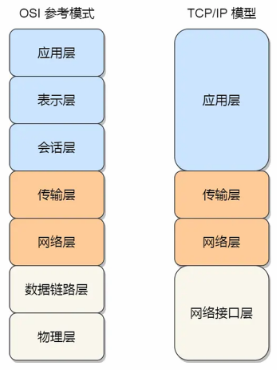 

#### 正向代理 和 反向代理的区别

**正向代理和反向代理的主要区别如下:**

1. **代理对象不同:**
   - 正向代理代理的是客户端,客户端通过正向代理访问目标服务器。
   - 反向代理代理的是服务器,客户端访问服务器时,先经过反向代理。
2. **目的不同:**
   - 正向代理的目的是为客户端提供访问外部网络的能力,隐藏和保护客户端。
   - 反向代理的目的是为服务器提供访问控制、负载均衡、缓存等功能,隐藏和保护服务器。
3. **位置不同:**
   - 正向代理位于客户端和目标服务器之间。
   - 反向代理位于目标服务器和客户端之间。
4. **知晓程度不同:**
   - 正向代理的存在对客户端是可见的,客户端需要配置正向代理服务器地址。
   - 反向代理的存在对客户端是透明的,客户端无需感知反向代理的存在。
5. **应用场景不同:**
   - 正向代理常用于突破网络访问限制、提高访问速度、提供匿名访问等。
   - 反向代理常用于负载均衡、缓存、安全防护等。

>  总的来说,正向代理和反向代理的核心区别在于代理的对象和目的不同。正向代理服务于客户端,反向代理服务于服务器。

#### Http 请求有哪几种常见类型

HTTP 协议中常见的 HTTP 请求方法有以下几种:

1. **GET**: 用于从服务器获取资源。这是最常见的 HTTP 请求方法。
2. **POST**: 用于向服务器提交数据,如表单数据。
3. **HEAD**: 与 GET 请求类似,但只返回响应头部信息,不返回响应体。
4. **PUT**: 用于上传文件或替换目标资源。
5. **DELETE**: 用于删除指定的资源。
6. **OPTIONS**: 用于获取目标资源所支持的 HTTP 方法。
7. **TRACE**: 用于激活消息的回环测试,主要用于诊断目的。
8. **CONNECT**: 用于建立到服务器的隧道连接,通常用于代理服务器。
9. **PATCH**: 用于对资源进行部分更新。

这些 HTTP 请求方法中,GET 和 POST 是最常见和基本的两种,其他方法通常用于一些特殊的场景。

HTTP 请求方法的选择取决于需求和使用场景。比如:

- 获取资源使用 GET
- 提交表单数据使用 POST
- 更新资源使用 PUT 或 PATCH
- 删除资源使用 DELETE

合理选择 HTTP 请求方法可以让应用程序更加规范和高效。

#### Http 中 HEAD 请求与 GET 请求的区别

HTTP `HEAD` 请求方法是 HTTP 协议中的一种请求方法,它与 `GET` 方法非常相似,但有一些不同之处:

1. **发送的数据不同**:
   - `GET` 请求会返回请求资源的完整内容,包括头部信息和实体内容。
   - `HEAD` 请求只返回请求资源的头部信息,不返回实体内容。
2. **用途不同**:
   - `GET` 请求通常用于获取资源的全部内容。
   - `HEAD` 请求通常用于获取资源的元数据信息,比如文件大小、最后修改时间等,而不需要获取整个资源的内容。这在某些场景下更加高效和节省带宽。
3. **缓存处理不同**:
   - `GET` 请求会触发缓存机制,根据缓存策略决定是否从缓存中读取资源。
   - `HEAD` 请求也会触发缓存机制,但只检查头部信息,不会读取资源内容。

使用 `HEAD` 请求的一些常见场景包括:

- 检查资源是否存在以及其最后修改时间。
- 确定资源的大小或类型,而不需要下载整个资源。
- 在重复下载资源之前快速检查资源是否有更新。
- 在程序中执行一些预检查操作,以优化后续的请求。

总之,`HEAD` 请求主要用于获取资源的元数据信息,而不是获取资源的全部内容,这在某些场景下可以提高效率和节省带宽。

#### 交换机和路由器的区别

路由器和交换机都是网络设备，但它们在网络中的功能有所不同。下面是它们的主要区别：

##### 交换机 (Switch)

1. **主要功能**：
   - 交换机主要用于连接多个设备（如计算机、服务器等）在同一局域网（LAN）内，并促进这些设备之间的数据传输。
2. **工作层级**：
   - 传统以太网交换机通常工作在OSI模型的第二层（数据链路层），能够根据MAC地址转发数据包。
   - 智能交换机或第3层交换机还可以执行基于IP地址的数据包路由。
3. **转发机制**：
   - 交换机会学习连接到它的设备的MAC地址，并创建一个MAC地址表，以便高效地将数据帧转发到正确的目的端口。
4. **分割冲突域**：
   - 交换机通过为每个端口提供全双工通信能力来分割冲突域，这意味着每个端口上的设备可以同时发送和接收数据，而不会相互干扰。
5. **使用场景**：
   - 交换机通常用于构建局域网内的子网，例如办公室或家庭网络。

##### 路由器 (Router)

1. **主要功能**：
   - 路由器用于在不同的网络之间路由数据包，包括局域网与广域网（WAN）之间的数据传输。
2. **工作层级**：
   - 路由器工作在OSI模型的第三层（网络层），根据IP地址进行数据包的转发。
3. **转发机制**：
   - 路由器维护一个路由表，其中包含到达不同网络的路径信息。当接收到数据包时，路由器会检查其目的IP地址，并根据路由表选择最佳路径进行转发。
4. **分割广播域**：
   - 路由器可以分割广播域，这意味着它可以在不同的网络间隔离广播流量，减少不必要的网络负载。
5. **使用场景**：
   - 路由器常用于连接不同的网络，例如连接局域网至互联网，或者连接不同的局域网。

总结来说，交换机主要用于局域网内部的数据传输，而路由器则负责不同网络间的通信。两者通常会在企业级网络中共同部署，以实现完整且高效的网络连接。

#### 冲突域和广播域是什么？

- **冲突域**关注的是数据包在共享介质上的碰撞问题，通过交换机等技术来减少冲突。
- **广播域**关注的是广播消息的传播范围，通过路由器或VLAN技术来分割广播域，减少不必要的广播流量。

#### HTTP 数据包的传输流程

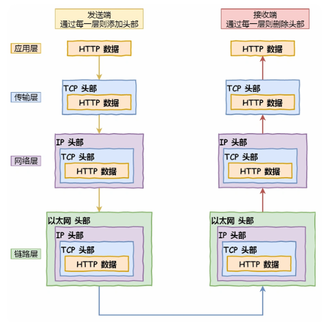  

#### 关于 MAC 地址和 ARP 协议的一些问题

> 读者问：“请问公⽹服务器的 Mac 地址是在什么时机通过什么⽅式获取到的？我看 ARP 获取 Mac 地址只能 获取到内⽹机器的 Mac 地址吧？"

**答**：在发送数据包时，如果⽬标主机不是本地局域⽹，填⼊的 MAC 地址是路由器，也就是把数据包转发给路 由器，路由器⼀直转发下⼀个路由器，直到转发到⽬标主机的路由器，发现⽬标 IP 地址是⾃⼰局域⽹内的 主机，就会 ARP 请求获取⽬标主机的 MAC 地址，从⽽转发到这个服务器主机。

转发的过程中，源 IP 地址和⽬标 IP 地址是不会变的（前提：没有使⽤ NAT ⽹络的），源 MAC 地址和⽬ 标 MAC 地址是会变化的。

#### 关于数据的封装

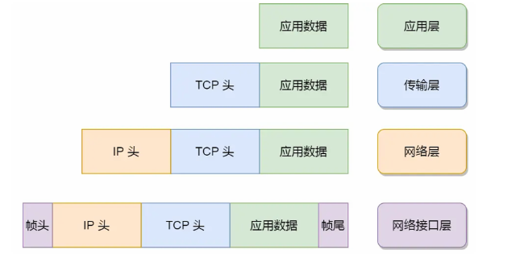 

传输层，给应⽤数据前⾯增加了 TCP  头；

⽹络层，给 TCP 数据包前⾯增加了 IP  头； 

⽹络接⼝层，给 IP 数据包前后分别增加了帧头和帧尾

#### GET方法 和 POST方法都是安全和幂等的吗？

先说明下安全和幂等的概念：

- 在 HTTP 协议里，所谓的「安全」是指请求方法不会「破坏」服务器上的资源。
- 所谓的「幂等」，意思是多次执行相同的操作，结果都是「相同」的。

如果从 RFC 规范定义的语义来看：

- **GET 方法就是安全且幂等的**，因为它是「只读」操作，无论操作多少次，服务器上的数据都是安全的，且每次的结果都是相同的。所以，**可以对 GET 请求的数据做缓存，这个缓存可以做到浏览器本身上（彻底避免浏览器发请求），也可以做到代理上（如nginx），而且在浏览器中 GET 请求可以保存为书签**。
- **POST** 因为是「新增或提交数据」的操作，会修改服务器上的资源，所以是**不安全**的，且多次提交数据就会创建多个资源，所以**不是幂等**的。所以，**浏览器一般不会缓存 POST 请求，也不能把 POST 请求保存为书签**。

#### 什么是强制缓存？

强缓存指的是只要浏览器判断缓存没有过期，则直接使用浏览器的本地缓存，决定是否使用缓存的主动性在于浏览器这边。

强缓存是利用下面这两个 HTTP 响应头部（Response Header）字段实现的，它们都用来表示资源在客户端缓存的有效期：

- `Cache-Control`， 是一个相对时间；
- `Expires`，是一个绝对时间；

如果 HTTP 响应头部同时有 Cache-Control 和 Expires 字段的话，**Cache-Control 的优先级高于 Expires** 。

Cache-control 选项更多一些，设置更加精细，所以建议使用 Cache-Control 来实现强缓存。具体的实现流程如下：

- 当浏览器第一次请求访问服务器资源时，服务器会在返回这个资源的同时，在 Response 头部加上 Cache-Control，Cache-Control 中设置了过期时间大小；
- 浏览器再次请求访问服务器中的该资源时，会先**通过请求资源的时间与 Cache-Control 中设置的过期时间大小，来计算出该资源是否过期**，如果没有，则使用该缓存，否则重新请求服务器；
- 服务器再次收到请求后，会再次更新 Response 头部的 Cache-Control。

#### 什么是协商缓存？

当我们在浏览器使用开发者工具的时候，你可能会看到过某些请求的响应码是 `304`，这个是告诉浏览器可以使用本地缓存的资源，通常这种通过服务端告知客户端是否可以使用缓存的方式被称为协商缓存。

协商缓存可以基于两种头部来实现。

第一种：请求头部中的 `If-Modified-Since` 字段与响应头部中的 `Last-Modified` 字段实现，这两个字段的意思是：

- 响应头部中的 `Last-Modified`：标示这个响应资源的最后修改时间；
- 请求头部中的 `If-Modified-Since`：当资源过期了，发现响应头中具有 Last-Modified 声明，则再次发起请求的时候带上 Last-Modified 的时间，服务器收到请求后发现有 If-Modified-Since 则与被请求资源的最后修改时间进行对比（Last-Modified），如果最后修改时间较新（大），说明资源又被改过，则返回最新资源，HTTP 200 OK；如果最后修改时间较旧（小），说明资源无新修改，响应 HTTP 304 走缓存。

第二种：请求头部中的 `If-None-Match` 字段与响应头部中的 `ETag` 字段，这两个字段的意思是：

- 响应头部中 `Etag`：唯一标识响应资源；
- 请求头部中的 `If-None-Match`：当资源过期时，浏览器发现响应头里有 Etag，则再次向服务器发起请求时，会将请求头 If-None-Match 值设置为 Etag 的值。服务器收到请求后进行比对，如果资源没有变化返回 304，如果资源变化了返回 200。

第一种实现方式是基于时间实现的，第二种实现方式是基于一个唯一标识实现的，相对来说后者可以更加准确地判断文件内容是否被修改，避免由于时间篡改导致的不可靠问题。

如果在第一次请求资源的时候，服务端返回的 HTTP 响应头部同时有 Etag 和 Last-Modified 字段，那么客户端再下一次请求的时候，如果带上了 ETag 和 Last-Modified 字段信息给服务端，**这时 Etag 的优先级更高**，也就是服务端先会判断 Etag 是否变化了，如果 Etag 有变化就不用在判断 Last-Modified 了，如果 Etag 没有变化，然后再看 Last-Modified。

**为什么 ETag 的优先级更高？**这是因为 ETag 主要能解决 Last-Modified 几个比较难以解决的问题：

1. 在没有修改文件内容情况下文件的最后修改时间可能也会改变，这会导致客户端认为这文件被改动了，从而重新请求；
2. 可能有些文件是在秒级以内修改的，`If-Modified-Since` 能检查到的粒度是秒级的，使用 Etag就能够保证这种需求下客户端在 1 秒内能刷新多次；
3. 有些服务器不能精确获取文件的最后修改时间。

注意，**协商缓存这两个字段都需要配合强制缓存中 Cache-Control 字段来使用，只有在未能命中强制缓存的时候，才能发起带有协商缓存字段的请求**。

下图是强制缓存和协商缓存的工作流程：

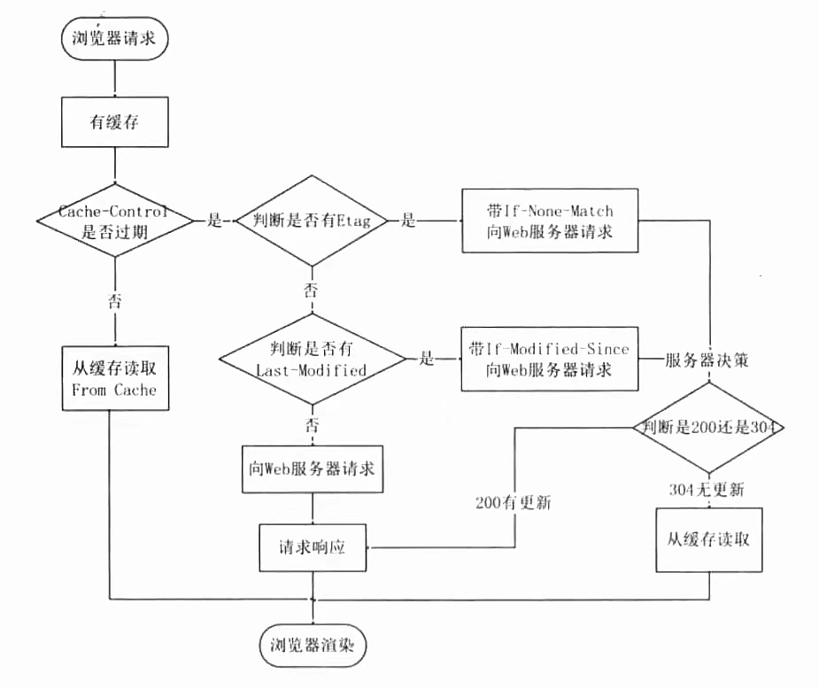 

当使用 ETag 字段实现的协商缓存的过程：

- 当浏览器第一次请求访问服务器资源时，服务器会在返回这个资源的同时，在 Response 头部加上 ETag 唯一标识，这个唯一标识的值是根据当前请求的资源生成的；

- 当浏览器再次请求访问服务器中的该资源时，首先会先检查强制缓存是否过期：

  - 如果没有过期，则直接使用本地缓存；
  - 如果缓存过期了，会在 Request 头部加上 If-None-Match 字段，该字段的值就是 ETag 唯一标识；

- 服务器再次收到请求后，

  会根据请求中的 If-None-Match 值与当前请求的资源生成的唯一标识进行比较：

  - **如果值相等，则返回 304 Not Modified，不会返回资源**；
  - 如果不相等，则返回 200 状态码和返回资源，并在 Response 头部加上新的 ETag 唯一标识；
  
- 如果浏览器收到 304 的请求响应状态码，则会从本地缓存中加载资源，否则更新资源。

#### Https 解决了 Http 中的哪些问题？

HTTPS (HyperText Transfer Protocol Secure) 解决了HTTP (HyperText Transfer Protocol) 存在的一些关键安全问题。以下是HTTPS解决的主要问题：

1. **数据加密**：
   - HTTP使用明文传输数据，这意味着任何在网络中嗅探的人都可以读取这些数据。HTTPS通过使用SSL/TLS协议对传输的数据进行加密，确保即使数据被截获也无法被解密和阅读。
2. **身份验证**：
   - HTTP无法验证服务器的身份，这意味着用户无法确定他们正在访问的网站是否是真正的目标网站。HTTPS通过使用数字证书和证书颁发机构 (CA) 进行签名来验证服务器的身份，从而确保用户连接到正确的服务器上。
3. **数据完整性**：
   - 在HTTP中，数据传输过程中可能会被篡改。HTTPS提供了数据完整性的保证，确保从发送方到接收方的数据未被更改或损坏。
4. **防止中间人攻击**：
   - 中间人攻击是指攻击者位于客户端和服务器之间的网络路径上，能够监听或修改双方之间的通信。HTTPS通过加密和身份验证机制防止此类攻击。
5. **隐私保护**：
   - HTTP缺乏隐私保护，用户的浏览行为容易被第三方追踪和记录。HTTPS通过加密通道保护用户的隐私，使第三方难以追踪用户的活动。
6. **安全性增强**：
   - HTTPS增强了整个Web生态系统的安全性，有助于防止各种类型的网络攻击，例如SQL注入、跨站脚本攻击(XSS)和跨站请求伪造(CSRF)等。

综上所述，HTTPS通过使用SSL/TLS协议，不仅加密了通信内容，还提供了服务器身份验证，增强了数据的完整性和安全性，从而显著提高了Web通信的安全水平。对于涉及敏感信息传输的应用场景（如在线银行、电子商务、社交媒体等），HTTPS是必不可少的。

**以下是 SSL/TLS 过程**

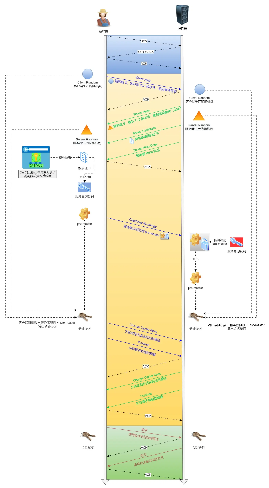 

#### HTTPS 一定是可靠的吗？

> 如果有假基站起了转发全部消息的作用，这样是不是假基站就获取到了全部信息了，从而造成信息泄露了？

这个问题的场景是这样的：客户端通过浏览器向服务端发起 HTTPS 请求时，被「假基站」转发到了一个「中间人服务器」，于是客户端是和「中间人服务器」完成了 TLS 握手，然后这个「中间人服务器」再与真正的服务端完成 TLS 握手。

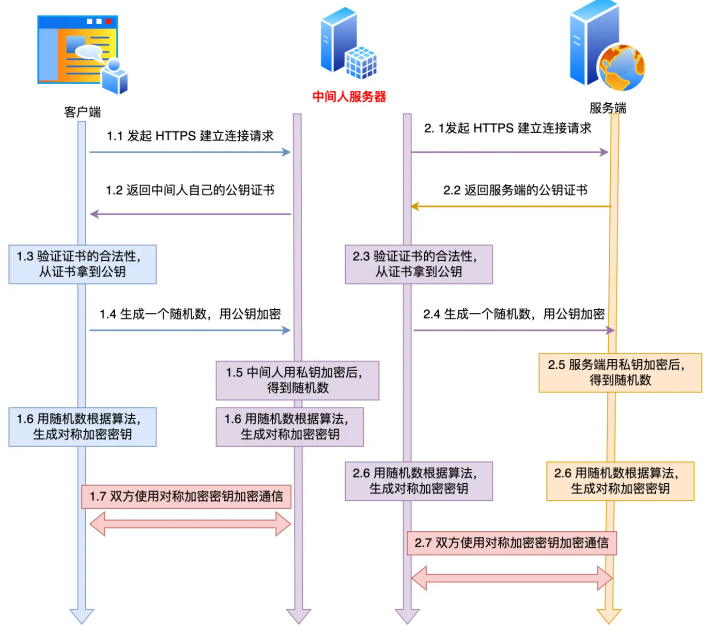 

具体过程如下：

- 客户端向服务端发起 HTTPS 建立连接请求时，然后被「假基站」转发到了一个「中间人服务器」，接着中间人向服务端发起 HTTPS 建立连接请求，此时客户端与中间人进行 TLS 握手，中间人与服务端进行 TLS 握手；
- 在客户端与中间人进行 TLS 握手过程中，中间人会发送自己的公钥证书给客户端，**客户端验证证书的真伪**，然后从证书拿到公钥，并生成一个随机数，用公钥加密随机数发送给中间人，中间人使用私钥解密，得到随机数，此时双方都有随机数，然后通过算法生成对称加密密钥（A），后续客户端与中间人通信就用这个对称加密密钥来加密数据了。
- 在中间人与服务端进行 TLS 握手过程中，服务端会发送从 CA 机构签发的公钥证书给中间人，从证书拿到公钥，并生成一个随机数，用公钥加密随机数发送给服务端，服务端使用私钥解密，得到随机数，此时双方都有随机数，然后通过算法生成对称加密密钥（B），后续中间人与服务端通信就用这个对称加密密钥来加密数据了。
- 后续的通信过程中，中间人用对称加密密钥（A）解密客户端的 HTTPS 请求的数据，然后用对称加密密钥（B）加密 HTTPS 请求后，转发给服务端，接着服务端发送 HTTPS 响应数据给中间人，中间人用对称加密密钥（B）解密 HTTPS 响应数据，然后再用对称加密密钥（A）加密后，转发给客户端。

从客户端的角度看，其实并不知道网络中存在中间人服务器这个角色。那么中间人就可以解开浏览器发起的 HTTPS 请求里的数据，也可以解开服务端响应给浏览器的 HTTPS 响应数据。相当于，中间人能够 “偷看” 浏览器与服务端之间的 HTTPS 请求和响应的数据。

但是要发生这种场景是有前提的，前提是用户点击接受了中间人服务器的证书。

中间人服务器与客户端在 TLS 握手过程中，实际上发送了自己伪造的证书给浏览器，而这个伪造的证书是能被浏览器（客户端）识别出是非法的，于是就会提醒用户该证书存在问题。

如果用户执意点击「继续浏览此网站」，相当于用户接受了中间人伪造的证书，那么后续整个 HTTPS 通信都能被中间人监听了。

所以，这其实并不能说 HTTPS 不够安全，毕竟浏览器都已经提示证书有问题了，如果用户坚决要访问，那不能怪 HTTPS ，得怪自己手贱。

另外，如果你的电脑中毒了，被恶意导入了中间人的根证书，那么在验证中间人的证书的时候，由于你操作系统信任了中间人的根证书，那么等同于中间人的证书是合法的，这种情况下，浏览器是不会弹出证书存在问题的风险提醒的。

这其实也不关 HTTPS 的事情，是你电脑中毒了才导致 HTTPS 数据被中间人劫持的。

所以，**HTTPS 协议本身到目前为止还是没有任何漏洞的，即使你成功进行中间人攻击，本质上是利用了客户端的漏洞（用户点击继续访问或者被恶意导入伪造的根证书），并不是 HTTPS 不够安全**。

#### 为什么抓包工具能截取 HTTPS 数据？

很多抓包工具 之所以可以明文看到 HTTPS 数据，工作原理与中间人一致的。

对于 HTTPS 连接来说，中间人要满足以下两点，才能实现真正的明文代理:

1. 中间人，作为客户端与真实服务端建立连接这一步不会有问题，因为服务端不会校验客户端的身份；
2. 中间人，作为服务端与真实客户端建立连接，这里会有客户端信任服务端的问题，也就是服务端必须有对应域名的私钥；

**中间人要拿到私钥只能通过如下方式：**

1. 去网站服务端拿到私钥；
2. 去CA处拿域名签发私钥；
3. 自己签发证书，切要被浏览器信任；

不用解释，抓包工具只能使用第三种方式取得中间人的身份。

使用抓包工具进行 HTTPS 抓包的时候，需要在客户端安装 Fiddler 的根证书，这里实际上起认证中心（CA）的作用。

抓包工具能够抓包的关键是客户端会往系统受信任的根证书列表中导入抓包工具生成的证书，而这个证书会被浏览器信任，也就是抓包工具给自己创建了一个认证中心 CA，客户端拿着中间人签发的证书去中间人自己的 CA 去认证，当然认为这个证书是有效的。

#### 如何避免被中间人抓取数据？

我们要保证自己电脑的安全，不要被病毒乘虚而入，而且也不要点击任何证书非法的网站，这样 HTTPS 数据就不会被中间人截取到了。

当然，我们还可以通过 **HTTPS 双向认证**来避免这种问题。

一般我们的 HTTPS 是单向认证，客户端只会验证了服务端的身份，但是服务端并不会验证客户端的身份。

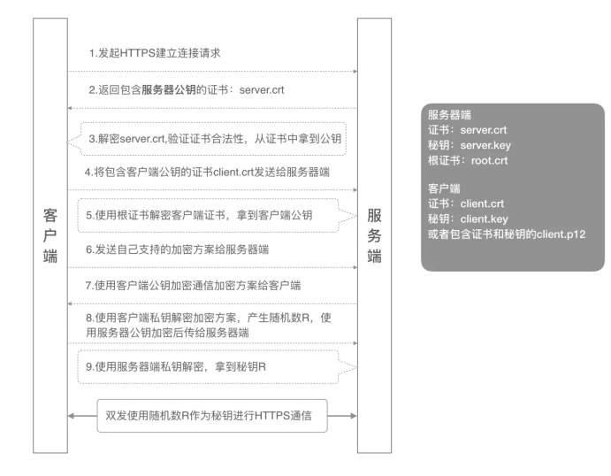 

如果用了双向认证方式，不仅客户端会验证服务端的身份，而且服务端也会验证客户端的身份。服务端一旦验证到请求自己的客户端为不可信任的，服务端就拒绝继续通信，客户端如果发现服务端为不可信任的，那么也中止通信。

#### 关于 Https 和 Http 的一些问题

> 读者问：“https 和 http 相比，就是传输的内容多了对称加密，可以这么理解吗？”

1. 建立连接时候：https 比 http多了 TLS 的握手过程；
2. 传输内容的时候：https 会把数据进行加密，通常是对称加密数据；

3. Https 还使用数据证书来验证服务器的身份
4. Https 使用混合加密方式来确保数据的安全传输

> 读者问：“ 我看文中 TLS 和 SSL 没有做区分，这两个需要区分吗？”

这两实际上是一个东西。

SSL 是洋文 “*Secure Sockets Layer*” 的缩写，中文叫做「安全套接层」。它是在上世纪 90 年代中期，由网景公司设计的。

到了1999年，SSL 因为应用广泛，已经成为互联网上的事实标准。IETF 就在那年把 SSL 标准化。标准化之后的名称改为 TLS（是 “*Transport Layer Security*” 的缩写），中文叫做 「传输层安全协议」。

很多相关的文章都把这两者并列称呼（SSL/TLS），因为这两者可以视作同一个东西的不同阶段。

#### 什么是 TCP 的慢启动？

慢启动的主要目的是在连接建立初期，逐步增加数据传输速率，以适应网络的带宽和避免突然的数据洪流引起网络拥塞。通过这种方式，TCP可以有效地利用可用带宽，同时减少数据包丢失的风险。

假设初始cwnd为2 MSS，在慢启动阶段，如果连续收到两个ACK确认，cwnd将会增加到4 MSS。如果再收到两个ACK确认，cwnd将增加到8 MSS，以此类推，直到达到ssthresh为止。

**总结：**TCP慢启动是一种有效的拥塞控制机制，它通过逐步增加发送速率来避免网络拥塞，同时最大化网络资源的利用率。通过这种方法，TCP能够在维持网络稳定的同时提供高效的传输服务。

#### 如何减少Http的请求次数? 

[3.2 HTTP/1.1 如何优化？ | 小林coding (xiaolincoding.com)](https://xiaolincoding.com/network/2_http/http_optimize.html#如何减少-http-请求次数)

减少 HTTP 请求次数自然也就提升了 HTTP 性能，可以从这 3 个方面入手：

- *减少重定向请求次数*；
- *合并请求*；
- *延迟发送请求*；

##### 减少重定向请求次数

**如果将重定向的工作交由代理服务器完成，就能减少HTTP的请求次数**

##### **合并请求**

**合并请求的方式就是合并资源，以一个大资源的请求替换多个小资源的请求**。

但是这样的合并请求会带来新的问题，**当大资源中的某一个小资源发生变化后，客户端必须重新下载整个完整的大资源文件**，这显然带来了额外的网络消耗。

##### 延迟发送请求

不要一口气吃成大胖子，一般 HTML 里会含有很多 HTTP 的 URL，当前不需要的资源，我们没必要也获取过来，于是可以通过「**按需获取**」的方式，来减少第一时间的 HTTP 请求次数。

请求网页的时候，没必要把全部资源都获取到，而是只获取当前用户所看到的页面资源，当用户向下滑动页面的时候，再向服务器获取接下来的资源，这样就达到了延迟发送请求的效果。

#### 优化 HTTP/1.1 协议的思路

这次主要从 3 个方面介绍了优化 HTTP/1.1 协议的思路。

第一个思路是，通过缓存技术来避免发送 HTTP 请求。客户端收到第一个请求的响应后，可以将其缓存在本地磁盘，下次请求的时候，如果缓存没过期，就直接读取本地缓存的响应数据。如果缓存过期，客户端发送请求的时候带上响应数据的摘要，服务器比对后发现资源没有变化，就发出不带包体的 304 响应，告诉客户端缓存的响应仍然有效。

第二个思路是，减少 HTTP 请求的次数，有以下的方法：

1. 将原本由客户端处理的重定向请求，交给代理服务器处理，这样可以减少重定向请求的次数；
2. 将多个小资源合并成一个大资源再传输，能够减少 HTTP 请求次数以及 头部的重复传输，再来减少 TCP 连接数量，进而省去 TCP 握手和慢启动的网络消耗；
3. 按需访问资源，只访问当前用户看得到/用得到的资源，当客户往下滑动，再访问接下来的资源，以此达到延迟请求，也就减少了同一时间的 HTTP 请求次数。

第三思路是，通过压缩响应资源，降低传输资源的大小，从而提高传输效率，所以应当选择更优秀的压缩算法。

不管怎么优化 HTTP/1.1 协议都是有限的，不然也不会出现 HTTP/2 和 HTTP/3 协议，后续我们再来介绍 HTTP/2 和 HTTP/3 协议。

#### HTTP/1.1 相比 HTTP/1.0 提高了什么性能？

HTTP/1.1 相比 HTTP/1.0 性能上的改进：

- 使用长连接的方式改善了 HTTP/1.0 短连接造成的性能开销。
- 支持管道（pipeline）网络传输，只要第一个请求发出去了，不必等其回来，就可以发第二个请求出去，可以减少整体的响应时间。

但 HTTP/1.1 还是有性能瓶颈：

- 请求 / 响应头部（Header）未经压缩就发送，首部信息越多延迟越大。只能压缩 `Body` 的部分；
- 发送冗长的首部。每次互相发送相同的首部造成的浪费较多；
- 服务器是按请求的顺序响应的，如果服务器响应慢，会招致客户端一直请求不到数据，也就是队头阻塞；
- 没有请求优先级控制；
- 请求只能从客户端开始，服务器只能被动响应。

#### HTTP/2 的主要特性有哪些？

HTTP/2 (Hypertext Transfer Protocol Version 2) 是 HTTP 协议的一个重大更新，旨在提高 Web 性能和减少延迟。HTTP/2 是 HTTP/1.1 的直接继任者，并且是在 2015 年由 IETF (Internet Engineering Task Force) 正式标准化的。下面是关于 HTTP/2 的一些关键特性和概念。

**主要特性**：

1. **二进制分帧（Binary Framing）：** HTTP/2 使用二进制格式而非文本格式来编码消息，这使得消息更容易解析，同时降低了解析错误的可能性。
2. **多路复用（Multiplexing）**：
   - HTTP/2 允许在一个单一的 TCP 连接上同时发送多个请求和响应
   - 这种多路复用的能力消除了 HTTP/1.1 中常见的队头阻塞（Head-of-Line Blocking）问题，提高了并发请求的效率。
3. **头部压缩（Header Compression）：** 
   - HTTP/2 使用 HPACK 算法来压缩请求和响应头部，减少头部信息的传输大小，从而减少带宽使用和延迟。
4. **服务器推送（Server Push）：** 
   - 服务器可以在响应客户端初始请求时主动推送额外的资源，如样式表或者脚本文件，而无需等待客户端显式请求这些资源

####  HPACK压缩方法是什么？

1. **静态表格 (Static Table)**

   - **静态表格** 是 HPACK 中的一个预定义表格，它包含了常用的 HTTP 头部字段及其值。例如，常见的 `Accept-Encoding: gzip` 字段会在静态表格中有一个固定的索引号。

   - 当客户端或服务器需要发送一个头部字段时，如果这个字段在静态表格中存在，那么只需要发送该字段的索引号即可，而不需要发送整个字段名和值。

2. **动态表格 (Dynamic Table)**

   - **动态表格** 是一个可变大小的缓存，用于存储最近使用的头部字段。

   - 当一个头部字段不在静态表格中时，它会被添加到动态表格中，并且后续可以使用该字段的索引来代替整个字段名和值。

   - 动态表格的大小可以通过配置来调整，并且可以通过特殊的指令来增加或减少其大小。

3. **上下文编码 (Context Encoding)**

   - **上下文编码** 是指 HPACK 根据前面的头部字段来预测后面的字段，以减少编码所需的数据量。

   - 例如，如果连续几个请求都包含了相同的头部字段，那么 HPACK 可以利用这一点来更高效地编码这些字段。

总的来说，HPACK 通过高效地压缩 HTTP 头部信息，极大地提高了 HTTP/2 的性能，尤其是在移动设备和高延迟网络环境下。随着 HTTP/3 和 QUIC 的发展，虽然 HPACK 不再直接应用于这些协议中，但其设计理念和技术仍然对网络传输优化有着深远的影响。

#### 既然有 HTTP 协议，为什么还要有 RPC ？

[既然有 HTTP 协议，为什么还要有 RPC？ | 小林coding (xiaolincoding.com)](https://xiaolincoding.com/network/2_http/http_rpc.html#http-和-rpc)

**TCP 是传输层的协议**，而基于 TCP 造出来的 HTTP 和**各类** RPC 协议，它们都只是定义了不同消息格式的**应用层协议**而已。

HTTP（HyperText Transfer Protocol）和 RPC（Remote Procedure Call）是用于不同目的和场景的协议。以下是为什么在有 HTTP 协议的情况下仍需要 RPC 的一些原因：

1. **用途和设计目的不同**

   - **HTTP**：设计用于传输超文本和其他资源，主要用于浏览器和服务器之间的通信。它是无状态的，每次请求都是独立的。

   - **RPC**：设计用于在分布式系统中调用远程服务，使得调用远程函数就像调用本地函数一样。它的目的是简化远程服务的调用过程。

2. **通讯模型**
   - **HTTP**：基于请求-响应模型，通常用于客户端-服务器架构。
   
   - **RPC**：可以支持同步和异步调用，通常用于服务间通信和微服务架构中。
   
3. **效率和性能**
   - **HTTP**：文本协议，通常会有较大的开销，尤其是在传输大量数据或需要高频率调用的场景下。
   
   - **RPC**：可以使用二进制协议（如 gRPC），相对而言更高效，适合高性能需求的应用场景。
   
4. **抽象级别**
   - **HTTP**：更多关注资源的传输和操作（GET、POST、PUT、DELETE 等），适合 RESTful 风格的 API。
   
   - **RPC**：关注的是调用远程函数，抽象级别更高，更接近于直接调用函数接口。
   
5. **协议和工具的丰富性**
   - **HTTP**：使用 HTTP 协议栈，较为通用和普遍，但对特定的远程调用场景可能不够高效。
   
   - **RPC**：例如 gRPC，基于 HTTP/2，支持流式传输、负载均衡、命名解析、认证等高级功能，专为高性能远程调用设计。
   
6. **错误处理和重试机制**

   - **HTTP**：主要依靠状态码和错误响应处理。

   - **RPC**：通常内置更丰富的错误处理和重试机制。

7. **语言和平台支持**

   - **HTTP**：广泛支持，但在跨语言调用和自动生成客户端代码方面可能不如 RPC 工具灵活。

   - **RPC**：如 gRPC，支持多种语言，并且可以自动生成客户端和服务器代码，简化开发过程。

综上所述，HTTP 和 RPC 各自有适用的场景和优势。HTTP 更适合资源导向的传输，而 RPC 更适合需要高效、频繁、复杂的远程调用的场景。根据具体需求选择合适的协议，能更好地满足应用的性能和功能需求。

#### 关于端口的知识点

##### 多个 TCP 服务进程可以同时绑定同一个端口吗？

多个 TCP 服务进程不能同时绑定到同一个端口。TCP 协议的设计原则之一就是确保唯一性，这意味着在同一台主机上，一个特定的端口号只能被一个进程绑定和监听。

#####  TCP 和 UDP 可以使用同一个端口吗？

答案：**可以的**。

传输层的「端口号」的作用，是为了区分同一个主机上不同应用程序的数据包。

简而言之，TCP 和 UDP 的端口号是共用的，但是它们之间的使用是独立的。这意味着一个特定的端口号可以在 TCP 和 UDP 上分别被不同的服务使用，而不会产生冲突。这在实际应用中是非常常见的做法。

##### 重启 TCP 服务进程时，为什么会出现“Address in use”的报错信息？又该怎么避免？

当你尝试重启 TCP 服务进程时遇到 "Address in use" 的错误信息，这通常是因为原来的进程虽然已经退出，但其占用的端口还没有被操作系统释放。这种情况通常发生在以下几种情形中：

1. **进程正常退出**：
   - 即使服务进程正常退出，其监听的端口也可能仍然处于 TIME_WAIT 状态。
   - TCP 连接在关闭时会进入一个 TIME_WAIT 状态，这是为了确保最后一个 ACK 数据包能够被正确地送达对方。
2. **进程异常终止**：
   - 如果服务进程异常终止（例如由于系统崩溃、进程被杀死等），其占用的端口可能仍然被操作系统认为是 "in use"。
3. **端口复用**：
   - 默认情况下，TCP 服务进程在退出后不能立即重新绑定到同一个端口，因为端口可能仍然处于 TIME_WAIT 状态。

**如何避免 "Address in use" 错误**

为了避免 "Address in use" 的错误，可以采取以下几种方法：

1. **使用 `SO_REUSEADDR` 选项**：
   - 在创建 socket 时，可以设置 `SO_REUSEADDR` 选项，这会让操作系统允许在服务进程退出后立即重新绑定到同一个端口。
   - 这个选项告诉操作系统，即使端口处于 TIME_WAIT 状态，也可以允许重新绑定。
   - 在大多数编程语言的网络编程库中，都有设置这个选项的方法。

#### TCP为什么是三次握手？不是两次、四次？


TCP (Transmission Control Protocol) 的三次握手 (Three-Way Handshake) 是建立 TCP 连接的过程。这个过程确保了连接的双方都能够正确地接收和发送数据。三次握手的过程如下：

1. **第一次握手 (SYN)**:
   - 客户端向服务器发送一个 SYN (Synchronize) 数据包，请求建立连接。
   - SYN 数据包包含了客户端选择的初始序列号。
2. **第二次握手 (SYN-ACK)**:
   - 服务器接收到客户端的 SYN 数据包后，发送一个 SYN-ACK 数据包作为响应。
   - SYN-ACK 数据包包含了服务器选择的初始序列号以及对客户端序列号的确认。
   - 这个步骤确认了客户端的初始序列号，并告知客户端服务器的初始序列号。
3. **第三次握手 (ACK)**:
   - 客户端接收到服务器的 SYN-ACK 数据包后，发送一个 ACK (Acknowledgment) 数据包确认服务器的序列号。
   - 这个步骤确认了服务器的初始序列号，完成了连接的建立。

##### 为什么需要三次握手？

1. **可靠性**:
   - 三次握手确保了连接的双方都准备好并且能够接收数据。
   - 通过确认序列号，确保双方都知道对方的序列号，从而确保数据包能够按照正确的顺序被接收。
2. **防止已失效的连接请求报文突然又传送到了服务端**:
   - 如果只有两次握手，客户端发送的连接请求 SYN 数据包在网络中长时间滞留，最终到达服务器，服务器可能会接受这个连接请求并建立连接。
   - 但是客户端并没有真正打算建立连接，因此不会发送确认，服务器将一直等待客户端的确认，浪费资源。
   - 第三次握手可以确保客户端确实想要建立连接。
3. **解决半连接问题**:
   - 三次握手可以确保客户端和服务器都确认了对方能够发送和接收数据。
   - 如果只有两次握手，可能存在一方发送了 SYN 数据包后就挂掉的情况，另一方则一直等待确认。
4. **确保数据包顺序**:
   - 三次握手确保了双方都知道对方的序列号，从而确保数据包能够按照正确的顺序被接收。

##### 为什么不是两次握手？

- 如果只有两次握手，客户端发送的连接请求 SYN 数据包在网络中长时间滞留后到达服务器，服务器会接受这个连接请求并建立连接。但由于客户端并未真正想要建立连接，它不会发送确认，导致服务器一直等待确认，浪费资源。

##### 为什么不是四次握手？

- 四次握手会导致不必要的复杂性和开销。三次握手已经足够确保连接的双方都准备好，并且能够接收和发送数据。
- 从效率的角度考虑，三次握手是最优的，既保证了连接的可靠性，又避免了不必要的复杂性。

##### 总结

三次握手是建立 TCP 连接的标准过程，它确保了连接的可靠性、数据包的正确顺序以及防止了已失效的连接请求报文被误处理。三次握手是一种精心设计的机制，既能确保连接的建立，又能避免不必要的资源浪费。

> TIP
>
> 有人问：客户端发送三次握手（ack 报文）后就可以发送数据了，而被动方此时还是 syn_received 状态，如果 ack 丢了，那客户端发的数据是不是也白白浪费了？
>
> 不是的，即使服务端还是在 syn_received 状态，收到了客户端发送的数据，还是可以建立连接的，并且还可以正常收到这个数据包。这是因为数据报文中是有 ack 标识位，也有确认号，这个确认号就是确认收到了第二次握手。如下图：
>
> 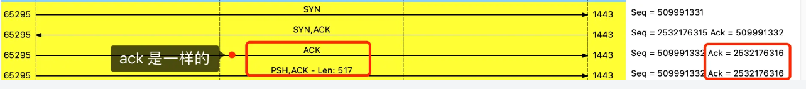
>
> 所以，服务端收到这个数据报文，是可以正常建立连接的，然后就可以正常接收这个数据包了。

不使用「两次握手」和「四次握手」的原因：

- 「两次握手」：无法防止历史连接的建立，会造成双方资源的浪费，也无法可靠的同步双方序列号；
- 「四次握手」：三次握手就已经理论上最少可靠连接建立，所以不需要使用更多的通信次数。

####  为什么每次建立 TCP 连接时，初始化的序列号都要求不一样呢？

**如果每次建立连接，客户端和服务端的初始化序列号都是一样的话，很容易出现历史报文被下一个相同四元组的连接接收的问题**。

如果每次建立连接客户端和服务端的初始化序列号都「不一样」，就有大概率因为历史报文的序列号「不在」对方接收窗口，从而很大程度上避免了历史报文

#### 在TCP三次握手中，每一次如果丢包各会发生什么情况？

[4.1 TCP 三次握手与四次挥手面试题 | 小林coding (xiaolincoding.com)](https://xiaolincoding.com/network/3_tcp/tcp_interview.html#第一次握手丢失了-会发生什么)

##### 第一次握手丢包

客户端会重传 SYN 报文

##### 第二次握手丢包

客户端和服务端都会重传

##### 第三次握手丢包

服务端会重传 SYN-ACK 报文，客户端发的ACK报文是不会重传的

#### 什么是 SYN 攻击？如何避免 SYN 攻击？

我们都知道 TCP 连接建立是需要三次握手，假设攻击者短时间伪造不同 IP 地址的 `SYN` 报文，服务端每接收到一个 `SYN` 报文，就进入`SYN_RCVD` 状态，但服务端发送出去的 `ACK + SYN` 报文，无法得到未知 IP 主机的 `ACK` 应答，久而久之就会**占满服务端的半连接队列**，使得服务端不能为正常用户服务。

在 TCP 三次握手的时候，Linux 内核会维护两个队列，分别是：

- 半连接队列，也称 SYN 队列；
- 全连接队列，也称 accept 队列；

#### TCP 关闭连接为什么要四次挥手，用三次挥手行吗？

##### **为什么需要四次挥手？**

1. **确保数据完整传输**:
   - 第一次挥手确保客户端不再发送数据，服务器收到 FIN 数据包后，可以确认客户端的数据已经发送完毕。
   - 第二次挥手确保客户端知道服务器收到了 FIN 数据包，此时服务器可能还在发送剩余的数据。
2. **确保双方都同意关闭连接**:
   - 第三次挥手确保服务器不再发送数据，客户端收到 FIN 数据包后，可以确认服务器的数据已经发送完毕。
   - 第四次挥手确保服务器知道客户端收到了 FIN 数据包，此时客户端处于 TIME_WAIT 状态，等待一段时间后才会真正关闭连接。
3. **处理半连接问题**:
   - 如果只有三次挥手，那么服务器可能会在发送 FIN 数据包后挂掉，而客户端在等待确认时不会知道服务器的状态。
   - 第四次挥手确保客户端知道服务器已经同意关闭连接，客户端可以在一段时间后安全地关闭连接。

##### 为什么不是三次挥手？

- 如果只有三次挥手，那么服务器发送 FIN 数据包后挂掉，客户端会一直在等待确认，不知道服务器的状态。
- 通过四次挥手，客户端可以确认服务器已经同意关闭连接，并且在一段时间后安全地关闭连接。

##### 为什么需要 TIME_WAIT 状态？

- TIME_WAIT 状态的存在是为了确保最后一个 ACK 数据包能够被服务器正确接收。
- 这样做的原因是防止已经失效的连接请求报文突然又传送到了服务器，导致服务器误以为这是一个新的连接请求。
- TIME_WAIT 状态的持续时间通常是 2MSL (Maximum Segment Lifetime)，MSL 的默认值是 2 分钟，所以等待时间大约是 4 分钟。

**总结：** TCP 连接关闭的标准过程，确保了连接的双方都同意关闭连接，并且所有的数据都已经正确地发送和接收。这个过程确保了数据的完整性和连接的可靠性。

#####  为什么 TIME_WAIT 等待的时间是 2MSL？

1. 为了防止历史连接中的数据，被后面相同四元组的连接错误的接收，因此 TCP 设计了 TIME_WAIT 状态，状态会持续 `2MSL` 时长，这个时间**足以让两个方向上的数据包都被丢弃，使得原来连接的数据包在网络中都自然消失，再出现的数据包一定都是新建立连接所产生的。**

2. 也就是说，TIME-WAIT 作用是**等待足够的时间以确保最后的 ACK 能让被动关闭方接收，从而帮助其正常关闭。**

   如果客户端（主动关闭方）最后一次 ACK 报文（第四次挥手）在网络中丢失了，那么按照 TCP 可靠性原则，服务端（被动关闭方）会重发 FIN 报文。

   假设客户端没有 TIME_WAIT 状态，而是在发完最后一次回 ACK 报文就直接进入 CLOSE 状态，如果该 ACK 报文丢失了，服务端则重传的 FIN 报文，而这时客户端已经进入到关闭状态了，在收到服务端重传的 FIN 报文后，就会回 RST 报文。

`2MSL` 的时间是从**客户端接收到 FIN 后发送 ACK 开始计时的**。如果在 TIME-WAIT 时间内，因为客户端的 ACK 没有传输到服务端，客户端又接收到了服务端重发的 FIN 报文，那么 **2MSL 时间将重新计时**。

#### 服务器出现大量 TIME_WAIT 状态的原因有哪些？

- 第一个场景：HTTP 没有使用长连接
- 第二个场景：HTTP 长连接超时
- 第三个场景：HTTP 长连接的请求数量达到上限

#### 没有 accept，能建立 TCP 连接吗？

答案：**可以的**。

在 TCP 协议中，服务器通过调用 `accept()` 函数来接受客户端的连接请求。如果没有调用 `accept()`，TCP 连接仍然可以建立，但是服务器将无法与客户端进行通信。

accpet 系统调用并不参与 TCP 三次握手过程，它只是负责从 TCP 全连接队列取出一个已经建立连接的 socket，用户层通过 accpet 系统调用拿到了已经建立连接的 socket，就可以对该 socket 进行读写操作了。

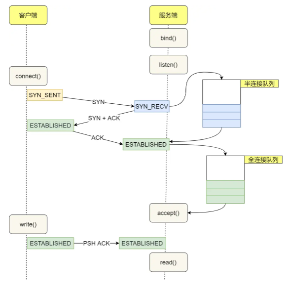 

#### 没有 listen，能建立 TCP 连接吗？

答案：**可以的**。

客户端是可以自己连自己的形成连接（**TCP自连接**），也可以两个客户端同时向对方发出请求建立连接（**TCP同时打开**），这两个情况都有个共同点，就是**没有服务端参与，也就是没有 listen，就能 TCP 建立连接。**

#### TCP流量控制相关问题

##### TCP 是如何解决窗口关闭时，潜在的死锁现象呢？

为了解决这个问题，TCP 为每个连接设有一个持续定时器，**只要 TCP 连接一方收到对方的零窗口通知，就启动持续计时器。**

如果持续计时器超时，就会发送**窗口探测 ( Window probe ) 报文**，而对方在确认这个探测报文时，给出自己现在的接收窗口大小。

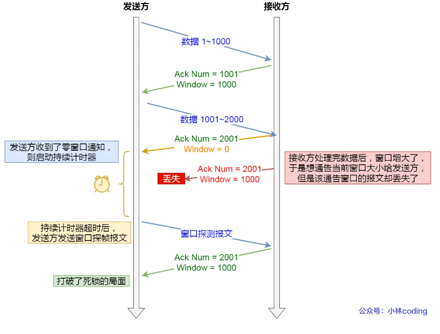 

- 如果接收窗口仍然为 0，那么收到这个报文的一方就会重新启动持续计时器；
- 如果接收窗口不是 0，那么死锁的局面就可以被打破了。

窗口探测的次数一般为 3 次，每次大约 30-60 秒（不同的实现可能会不一样）。如果 3 次过后接收窗口还是 0 的话，有的 TCP 实现就会发 `RST` 报文来中断连接。

#### TCP拥塞控制有哪些控制算法？

[TCP 重传、滑动窗口、流量控制、拥塞控制 | 小林coding (xiaolincoding.com)](https://xiaolincoding.com/network/3_tcp/tcp_feature.html#慢启动)

拥塞控制主要是四个算法：

- 慢启动：慢启动的意思就是一点一点的提高发送数据包，慢启动的算法记住一个规则就行：**当发送方每收到一个 ACK，拥塞窗口 cwnd 的大小就会加 1。**发包的个数是**指数性的增长**。
- 拥塞避免
- 拥塞发生
- 快速恢复、

> 那慢启动涨到什么时候是个头呢？

有一个叫慢启动门限 `ssthresh` （slow start threshold）状态变量。

- 当 `cwnd` < `ssthresh` 时，使用慢启动算法。
- 当 `cwnd` >= `ssthresh` 时，就会使用「拥塞避免算法」。

##### 拥塞避免

前面说道，当拥塞窗口 `cwnd` 「超过」慢启动门限 `ssthresh` 就会进入拥塞避免算法。

一般来说 `ssthresh` 的大小是 `65535` 字节。

那么进入拥塞避免算法后，它的规则是：**每当收到一个 ACK 时，cwnd 增加 1/cwnd。**

接上前面的慢启动的栗子，现假定 `ssthresh` 为 `8`：

- 当 8 个 ACK 应答确认到来时，每个确认增加 1/8，8 个 ACK 确认 cwnd 一共增加 1，于是这一次能够发送 9 个 `MSS` 大小的数据，变成了**线性增长。**

拥塞避免算法的变化过程如下图：

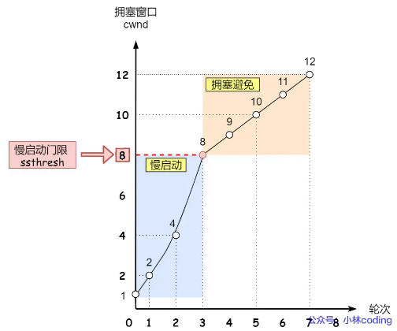 

##### 拥塞发生

当网络出现拥塞，也就是会发生数据包重传，重传机制主要有两种：

- 超时重传
- 快速重传

这两种使用的拥塞发送算法是不同的，接下来分别来说说。

> 发生超时重传的拥塞发生算法

当发生了「超时重传」，则就会使用拥塞发生算法。

这个时候，ssthresh 和 cwnd 的值会发生变化：

- `ssthresh` 设为 `cwnd/2`，
- `cwnd` 重置为 `1` （是恢复为 cwnd 初始化值，我这里假定 cwnd 初始化值 1）

#### 先来说说为什么 UDP 是面向报文的协议？

当用户消息通过 UDP 协议传输时，**操作系统不会对消息进行拆分**，在组装好 UDP 头部后就交给网络层来处理，所以发出去的 UDP 报文中的数据部分就是完整的用户消息，也就是**每个 UDP 报文就是一个用户消息的边界**，这样接收方在接收到 UDP 报文后，读一个 UDP 报文就能读取到完整的用户消息。

你可能会问，如果收到了两个 UDP 报文，操作系统是怎么区分开的？

操作系统在收到 UDP 报文后，会将其插入到队列里，**队列里的每一个元素就是一个 UDP 报文**，这样当用户调用 recvfrom() 系统调用读数据的时候，就会从队列里取出一个数据，然后从内核里拷贝给用户缓冲区。

#### 说说为什么 TCP 是面向字节流的协议？

当用户消息通过 TCP 协议传输时，**消息可能会被操作系统分组成多个的 TCP 报文**，也就是一个完整的用户消息被拆分成多个 TCP 报文进行传输。

这时，接收方的程序如果不知道发送方发送的消息的长度，也就是不知道消息的边界时，是无法读出一个有效的用户消息的，因为用户消息被拆分成多个 TCP 报文后，并不能像 UDP 那样，一个 UDP 报文就能代表一个完整的用户消息。

至于什么时候真正被发送，**取决于发送窗口、拥塞窗口以及当前发送缓冲区的大小等条件**。也就是说，我们不能认为每次 send 调用发送的数据，都会作为一个整体完整地消息被发送出去。

#### 在 TCP 正常挥手过程中，处于 TIME_WAIT 状态的连接，收到相同四元组的 SYN 后会发生什么？

如果双方开启了时间戳机制：

- 如果客户端的 SYN 的「序列号」比服务端「期望下一个收到的序列号」要**大**，**并且**SYN 的「时间戳」比服务端「最后收到的报文的时间戳」要**大**。那么就会重用该四元组连接，跳过 2MSL 而转变为 SYN_RECV 状态，接着就能进行建立连接过程。
- 如果客户端的 SYN 的「序列号」比服务端「期望下一个收到的序列号」要**小**，**或者**SYN 的「时间戳」比服务端「最后收到的报文的时间戳」要**小**。那么就会**再回复一个第四次挥手的 ACK 报文，客户端收到后，发现并不是自己期望收到确认号，就回 RST 报文给服务端**。

#### 什么是TCP 保活机制？

TCP保活机制（TCP Keepalive）是一种用于维持TCP连接活动状态的功能，特别是在长时间没有数据传输的情况下。TCP保活机制可以帮助检测并关闭已失效的连接，防止连接挂起导致的问题。以下是关于TCP保活机制的一些详细信息：

**目的**

- **检测失效连接**：长时间无数据交换可能会导致连接失效，保活机制可以帮助检测这种情况。
- **维护连接状态**：对于长期活跃但偶尔传输数据的连接，保活机制可以确保连接保持活跃状态。
- **减少资源浪费**：及时关闭失效连接可以释放系统资源。

**工作原理**

TCP保活机制的工作原理通常涉及以下几个步骤：

1. **初始化**：
   - 在连接建立时，双方可以协商是否启用保活机制。
   - 默认情况下，TCP保活机制可能处于禁用状态，需要通过特定的套接字选项或配置参数来启用。
2. **保活探测**：
   - 当连接一段时间内没有数据交换时，发送方开始发送保活探测（keepalive probes）。
   - 这些探测通常是空的数据包，仅用于测试连接是否仍然有效。
3. **探测间隔**：
   - 发送方每隔一定的时间间隔（例如2小时）发送第一个保活探测。
   - 如果在一段时间内（例如75秒）没有收到对方的响应，发送方会再次发送探测。
   - 如果多次发送探测仍未收到响应，发送方会认为连接已经失效，并关闭连接。
4. **关闭连接**：
   - 如果在多次尝试后仍未收到响应，发送方会发送一个带有RST标志的TCP段来关闭连接。
   - 这个过程有助于及时释放系统资源，避免无效连接占用端口或其他资源。

**配置**

在大多数操作系统中，可以通过设置特定的套接字选项来启用和配置TCP保活机制。例如，在Linux中，可以使用`setsockopt()`函数来设置如下选项：

- `SO_KEEPALIVE`：启用或禁用保活机制。
- `TCP_KEEPIDLE`：设置在开始发送保活探测之前要等待的空闲时间（单位通常是秒）。
- `TCP_KEEPINTVL`：设置发送两次保活探测之间的时间间隔（单位通常是秒）。
- `TCP_KEEPCNT`：设置在关闭连接前最多发送多少次保活探测。

**适用场景**

- **长连接**：对于需要长时间保持连接的应用，如FTP、SSH等。
- **监控和管理**：网络设备和服务器之间的管理连接。
- **低频交互**：需要定期检查连接状态的场景。

**注意事项**

- **资源消耗**：频繁的保活探测可能会增加网络负载，特别是在大规模部署中。
- **安全性**：在某些情况下，保活探测可能被用来进行扫描或探测网络设备的状态。

总之，TCP保活机制是一种有用的工具，可以帮助维护连接的有效性并及时发现连接问题。不过，启用保活机制需要根据具体的应用场景和需求来进行适当的配置。

> **提问**： 一个TCP连接，在没有打开 keep-alive 选项的情况下，没有数据交互，现在一端突然掉电和一端的进程crash掉了，请问这两种情况有什么区别？

##### **情况一**： 客户端掉电宕机

客户端主机崩溃了，服务端是**无法感知到的**，在加上服务端没有开启 TCP keepalive，又没有数据交互的情况下，**服务端的 TCP 连接将会一直处于 ESTABLISHED 连接状态**，直到服务端重启进程。

所以，我们可以得知一个点，在没有使用 TCP 保活机制且双方不传输数据的情况下，一方的 TCP 连接处在 ESTABLISHED 状态，并不代表另一方的连接还一定正常。

##### 情况二：服务器进程崩溃

TCP 的连接信息是由内核维护的，所以当服务端的进程崩溃后，内核需要回收该进程的所有 TCP 连接资源，于是内核会发送第一次挥手 FIN 报文，后续的挥手过程也都是在内核完成，并不需要进程的参与，所以即使服务端的进程退出了，还是能与客户端完成 TCP四次挥手的过程。

我自己做了实验，使用 kill -9 来模拟进程崩溃的情况，发现**在 kill 掉进程后，服务端会发送 FIN 报文，与客户端进行四次挥手**。

所以，即使没有开启 TCP keepalive，且双方也没有数据交互的情况下，如果其中一方的进程发生了崩溃，这个过程操作系统是可以感知的到的，于是就会发送 FIN 报文给对方，然后与对方进行 TCP 四次挥手。

> **提问**：在「**有数据传输**」的场景下的一些异常情况：
>
> - 第一种，客户端主机宕机，又迅速重启，会发生什么？
> - 第二种，客户端主机宕机，一直没有重启，会发生什么？

**情况一**：**客户端主机宕机，又迅速重启**

在客户端主机宕机后，服务端向客户端发送的报文会得不到任何的响应，在一定时长后，服务端就会触发**超时重传**机制，重传未得到响应的报文。

服务端重传报文的过程中，客户端主机重启完成后，客户端的内核就会接收重传的报文，然后根据报文的信息传递给对应的进程：

- 如果客户端主机上**没有**进程绑定该 TCP 报文的目标端口号，那么客户端内核就会**回复 RST 报文，重置该 TCP 连接**；
- 如果客户端主机上**有**进程绑定该 TCP 报文的目标端口号，由于客户端主机重启后，之前的 TCP 连接的数据结构已经丢失了，客户端内核里协议栈会发现找不到该 TCP 连接的 socket 结构体，于是就会**回复 RST 报文，重置该 TCP 连接**。

所以，**只要有一方重启完成后，收到之前 TCP 连接的报文，都会回复 RST 报文，以断开连接**。

**情况二：客户端主机宕机，一直没有重启**

这种情况，服务端超时重传报文的次数达到一定阈值后，内核就会判定出该 TCP 有问题，然后通过 Socket 接口告诉应用程序该 TCP 连接出问题了，于是服务端的 TCP 连接就会断开。

**总结：**

如果「**客户端进程崩溃**」，客户端的进程在发生崩溃的时候，内核会发送 FIN 报文，与服务端进行四次挥手。

但是，「**客户端主机宕机**」，那么是不会发生四次挥手的，具体后续会发生什么？还要看服务端会不会发送数据？

- 如果服务端会发送数据，由于客户端已经不存在，收不到数据报文的响应报文，服务端的数据报文会超时重传，当重传总间隔时长达到一定阈值（内核会根据 tcp_retries2 设置的值计算出一个阈值）后，会断开 TCP 连接；
- 如果服务端一直不会发送数据，再看服务端有没有开启 TCP keepalive 机制？
  - 如果有开启，服务端在一段时间没有进行数据交互时，会触发 TCP keepalive 机制，探测对方是否存在，如果探测到对方已经消亡，则会断开自身的 TCP 连接；
  - 如果没有开启，服务端的 TCP 连接会一直存在，并且一直保持在 ESTABLISHED 状态。

最后说句，TCP 牛逼，啥异常都考虑到了。

#### 客户端的端口可以重复使用吗？

**TCP 连接是由四元组（源IP地址，源端口，目的IP地址，目的端口）唯一确认的，那么只要四元组中其中一个元素发生了变化，那么就表示不同的 TCP 连接的。所以如果客户端已使用端口 64992 与服务端 A 建立了连接，那么客户端要与服务端 B 建立连接，还是可以使用端口 64992 的，因为内核是通过四元祖信息来定位一个 TCP 连接的，并不会因为客户端的端口号相同，而导致连接冲突的问题。**

#### 如何解决客户端 TCP 连接 TIME_WAIT 过多，导致无法与同一个服务器建立连接的问题？

前面我们提到，如果客户端都是与同一个服务器（目标地址和目标端口一样）建立连接，那么如果客户端 TIME_WAIT 状态的连接过多，当端口资源被耗尽，就无法与这个服务器再建立连接了。

针对这个问题，也是有解决办法的，那就是打开 `net.ipv4.tcp_tw_reuse` 这个内核参数。

**因为开启了这个内核参数后，客户端调用 connect 函数时，如果选择到的端口，已经被相同四元组的连接占用的时候，就会判断该连接是否处于 TIME_WAIT 状态，如果该连接处于 TIME_WAIT 状态并且 TIME_WAIT 状态持续的时间超过了 1 秒，那么就会重用这个连接，然后就可以正常使用该端口了。**

举个例子，假设客户端已经与服务器建立了一个 TCP 连接，并且这个状态处于 TIME_WAIT 状态：

```bash
客户端地址:端口           服务端地址:端口         TCP 连接状态
192.168.1.100:2222      172.19.11.21:8888     TIME_WAIT
```

然后客户端又与该服务器（172.19.11.21:8888）发起了连接，**在调用 connect 函数时，内核刚好选择了 2222 端口，接着发现已经被相同四元组的连接占用了：**

- 如果**没有开启** net.ipv4.tcp_tw_reuse 内核参数，那么内核就会选择下一个端口，然后继续判断，直到找到一个没有被相同四元组的连接使用的端口， 如果端口资源耗尽还是没找到，那么 connect 函数就会返回错误。
- 如果**开启**了 net.ipv4.tcp_tw_reuse 内核参数，就会判断该四元组的连接状态是否处于 TIME_WAIT 状态，**如果连接处于 TIME_WAIT 状态并且该状态持续的时间超过了 1 秒，那么就会重用该连接**，于是就可以使用 2222 端口了，这时 connect 就会返回成功。

再次提醒一次，开启了 net.ipv4.tcp_tw_reuse 内核参数，是客户端（连接发起方） 在调用 connect() 函数时才起作用，所以在服务端开启这个参数是没有效果的。

#### TCP什么情况会出现三次挥手的情况？

当被动关闭方（上图的服务端）在 TCP 挥手过程中，「**没有数据要发送」并且「开启了 TCP 延迟确认机制」，那么第二和第三次挥手就会合并传输，这样就出现了三次挥手。**

##### 什么是TCP延迟确认机制？

当发送没有携带数据的 ACK，它的网络效率也是很低的，因为它也有 40 个字节的 IP 头 和 TCP 头，但却没有携带数据报文。 为了解决 ACK 传输效率低问题，所以就衍生出了 **TCP 延迟确认**。 TCP 延迟确认的策略：

- 当有响应数据要发送时，ACK 会随着响应数据一起立刻发送给对方
- 当没有响应数据要发送时，ACK 将会延迟一段时间，以等待是否有响应数据可以一起发送
- 如果在延迟等待发送 ACK 期间，对方的第二个数据报文又到达了，这时就会立刻发送 ACK

#### TCP 序列号和确认号是如何变化的？

万能公式。

**发送的 TCP 报文：**

- **公式一：序列号 = 上一次发送的序列号 + len（数据长度）。特殊情况，如果上一次发送的报文是 SYN 报文或者 FIN 报文，则改为 上一次发送的序列号 + 1。**
- **公式二：确认号 = 上一次收到的报文中的序列号 + len（数据长度）。特殊情况，如果收到的是 SYN 报文或者 FIN 报文，则改为上一次收到的报文中的序列号 + 1。**
